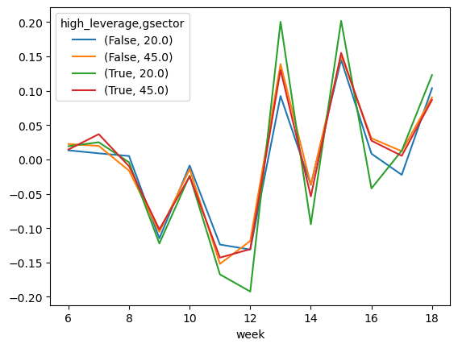
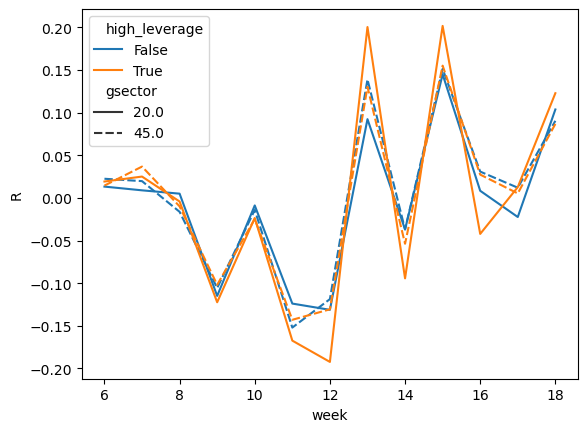
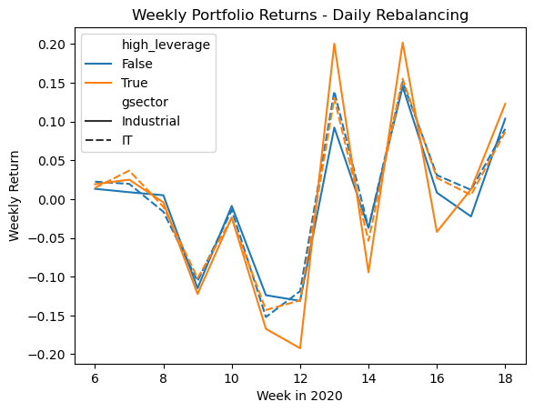
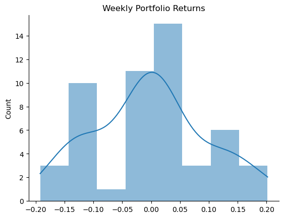
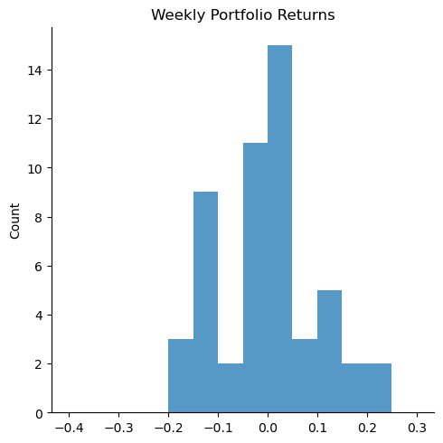
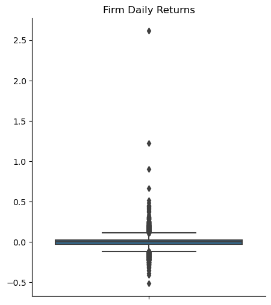
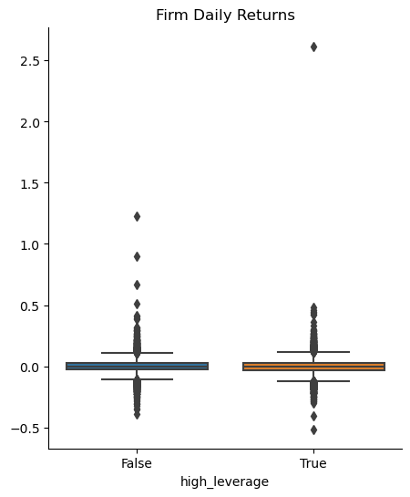
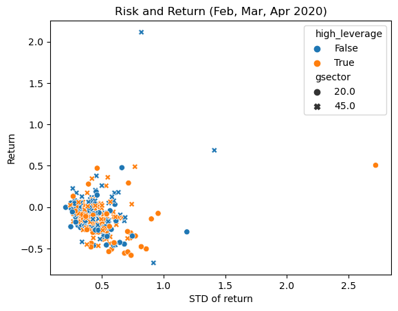
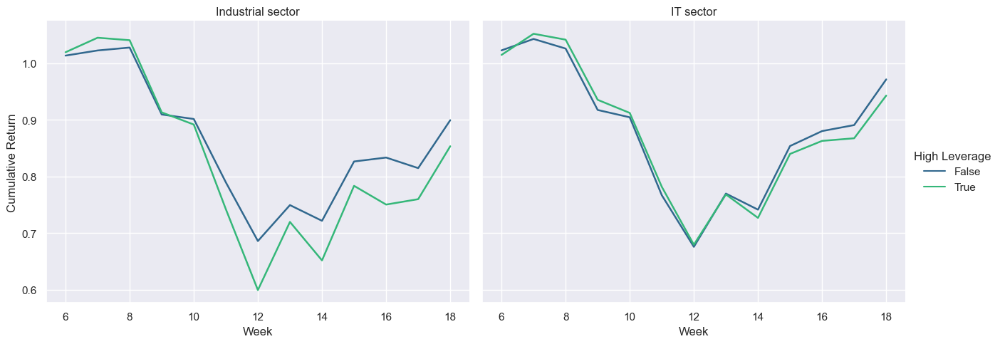

---
layout: wide_default
---  
# Plotting mechanics and EDA

**Run the code below, and read along.**

In the last assignment, I gave you a list of firms from 2020 with variables
- "gvkey", "lpermno", "lpermno" = different datasets use different identifiers for firms
- "fyear" = the fiscal year the remaining variable apply to 
- "gsector" = gsector, an industry classification (see [the wiki article on GICS](https://en.wikipedia.org/wiki/Global_Industry_Classification_Standard))
- "state" = of headquarters
- "tic" = ticker
- various accounting statistics

This data is a small slice of Compustat, which is a professional grade dataset that contains accounting data from SEC filings. 

We downloaded it and found a subsample of firms that we were interested in:


```python
import pandas as pd
import numpy as np
import seaborn as sns
import pandas_datareader as pdr  # to install: !pip install pandas_datareader
from datetime import datetime
import matplotlib.pyplot as plt 
import yfinance as yf
import warnings

# Suppress future warnings
warnings.simplefilter(action='ignore', category=FutureWarning)

plt.rcParams['patch.edgecolor'] = 'none' 

# this file can be found here: https://github.com/LeDataSciFi/ledatascifi-2021/tree/main/data
# if you click on the file, then click "raw", you'll be at the url below,
# which contains the raw data. pandas can download/load it without saving it locally!
url = 'https://github.com/LeDataSciFi/data/raw/main/Firm%20Year%20Datasets%20(Compustat)/firms2020.csv'
firms_df = pd.read_csv(url).drop_duplicates('tic') 

# add leverage 
firms_df['leverage'] = (firms_df['dlc']+firms_df['dltt'])/firms_df['at']

# high_lev = 1 if firm is above the median lev in its industry
firms_df['ind_med_lev'] = firms_df.groupby('gsector')['leverage'].transform('median')
firms_df.eval('high_leverage = leverage > ind_med_lev',inplace=True)

# problem: if lev is missing, the boolean above is false, so 
# high_lev = false... even if we don't know leverage!
# let's set those to missing (nan)
mask = (firms_df["leverage"].isnull()) | (firms_df["ind_med_lev"].isnull())
firms_df.loc[mask,"high_leverage"] = None

# reduce to subsample: (has leverage value and in our sectors)
subsample = firms_df.query('gsector in [45,20] & (high_leverage == 1 | high_leverage == 0)') 
ticker_list = subsample['tic'].to_list()
```

Now, 
1. I will download their daily stock returns, 
2. Compute (EW) portfolio returns,
3. Using (2), compute weekly total returns (cumulate the daily returns within each week). 
    - _Note: These are not buy-and-hold-returns, but rather **daily rebalancing!**_
    - _If you want buy-and-hold returns, you'd compute the weekly firm level returns, then average those compute the portfolio returns._


```python
##################################################################
# get daily firm stock returns
##################################################################

# I called this first df "stock_prices" in the last assignment

firm_rets   = (yf.download(ticker_list, 
                           start=datetime(2020, 2, 2), 
                           end=datetime(2020, 4, 30),
                           show_errors=False)
                .filter(like='Adj Close') # reduce to just columns with this in the name
                .droplevel(0,axis=1) # removes the level of the col vars that said "Adj Close", leaves symbols
               
                # reshape the data tall (3 vars: firm, date, price, return)
                .stack().swaplevel().sort_index().reset_index(name='Adj Close')
                .rename(columns={'Ticker':'Firm'})
 
                # create ret vars and merge in firm-level info
                .assign(ret = lambda x: x.groupby('Firm')['Adj Close'].pct_change())
                .merge(subsample[['tic','gsector','high_leverage']],
                       left_on='Firm',
                       right_on='tic')
               
               )
 
##################################################################
# get daily portfolio returns
##################################################################

# these portfolio returns are EQUALLY weighted each day (the .mean())
# this is as if you bought all the firms in equal dollars at the beginning 
# of the day, which means "daily rebalancing" --> each day you rebalance
# your portfolio so that it's equally weighted at the start of the day

daily_port_ret = (firm_rets
                  # for each portfolio and for each day
                  .groupby(['high_leverage','gsector','Date']) 
                  ['ret'].mean()                       # avg the return for that day for the firms in the port
                  .reset_index()                       # you can work with high_leverage/sector/date as index or vars
                                                       # I decided to convert them to variables and sort                                                    
                  .sort_values(['high_leverage','gsector','Date'])
                 )

##################################################################
# get weekly portfolio returns
##################################################################

# we will cumulate the daily portfolio returns so now we have a  
# dataframe that contains weekly returns for a few different portfolios

weekly_port_ret = (daily_port_ret
                   # compute gross returns for each asset (and get the week var)
                   .assign(R = 1+daily_port_ret['ret'],
                           week = daily_port_ret['Date'].dt.isocalendar().week.astype("int64"))
                   
                   # sidenote: dt.isocalander creates a variable with type "UInt32"
                   # this doesn't play great with sns, so I turned it into an integer ("int64")
                   
                   # for each portfolio and week...
                   .groupby(['high_leverage','gsector','week'])
                   # cumulate the returns
                   ['R'].prod()
                   # subtract one
                   -1
                  ).to_frame()
                   # this last line above (to_frame) isn't strictly necessary, but 
                   # the plotting functions play nicer with frames than series objs

```

    yfinance: download(show_errors=False) argument is deprecated and will be removed in future version. Do this instead to suppress error messages: logging.getLogger('yfinance').setLevel(logging.CRITICAL)


    [*********************100%%**********************]  388 of 388 completed


## Our first plot

We can plot the weekly potfolio returns easily. 

I use `weekly_port_ret.squeeze().unstack().T` to reshape the data like pandas wants (wide). Some students will benefit in understanding from running these lines:

```python
print(weekly_port_ret)
print('-'*40)
print(weekly_port_ret.squeeze())
print('-'*40)
print(weekly_port_ret.squeeze().unstack())
print('-'*40)
print(weekly_port_ret.squeeze().unstack().T)
print('-'*40)
```

Running those will help you see why each next thing is used. 


```python
ax = weekly_port_ret.squeeze().unstack().T.plot()
# can access customization via matplotliab methods on ax 
plt.show()
```


    

    


Doing this in seaborn is easy too, and I don't need to modify the data at all.


```python
ax = sns.lineplot(data = weekly_port_ret,
             x='week',y='R',hue='high_leverage',style='gsector')
# can access customization via matplotlib methods on ax 
plt.show()
```


    

    


## Part 1 - Plot formatting

Insert cell(s) below this one as needed to finish this Part.

Improve the plot above.
- Q1: set the title to "Weekly Portfolio Returns - Daily Rebalancing"
- Q2: set the x-axis title to "Week in 2020"
- Q3: set the y-axis title to "Weekly Return"
- Q4: Ungraded bonus challenge: change the legend so it says the industry names, not the numbers 


```python
ax = sns.lineplot(data = weekly_port_ret,
             x='week',y='R',hue='high_leverage',style='gsector')
# question 1
plt.title("Weekly Portfolio Returns - Daily Rebalancing")
# question 2
plt.xlabel("Week in 2020")
# question 3
plt.ylabel("Weekly Return")
# question 4: change the legend from gsector 20 to "Industrial" and gsector 45 to "IT"
handles, labels = ax.get_legend_handles_labels()
labels[4] = "Industrial" 
labels[5] = "IT"
ax.legend(handles, labels)
plt.show()
```


    

    


## Part 2 - Replicate/Imitate

Insert cell(s) below each bullet point and create as close a match as you can. This includes titles, axis numbering, everything you see. 

- Q5: Replicate F1.png. Notice the x-axis has no label - it's in the title.


```python
sns.histplot(data = weekly_port_ret, kde=True, x='R')
sns.despine()
plt.xlabel("")
plt.title("Weekly Portfolio Returns")
```


    Text(0.5, 1.0, 'Weekly Portfolio Returns')


    

    


- Q6: Replicate F2.png. Notice the bin sizes are 5%. (From 0-5%, 5-10%, ...)


```python
sns.displot(data = weekly_port_ret, x='R', binrange=(-0.4,0.3))
plt.xlabel("")
plt.title("Weekly Portfolio Returns")
```


    Text(0.5, 1.0, 'Weekly Portfolio Returns')


    

    


- Q7: Replicate F3.png. Pay attention to the header for a clue! 
    

  


```python
# firm daily returns
plt.figure(figsize=(5, 6))
sns.boxplot(data = firm_rets, y='ret')
sns.despine()
plt.ylabel("")
plt.title("Firm Daily Returns")
```


    Text(0.5, 1.0, 'Firm Daily Returns')


    

    


- Q8: Replicate F4.png. Pay attention to the header for a clue!
    

  


```python
plt.figure(figsize=(5, 6))
sns.boxplot(data = firm_rets, y='ret', x='high_leverage')
sns.despine()
plt.ylabel("")
plt.title("Firm Daily Returns")
```


    Text(0.5, 1.0, 'Firm Daily Returns')


    

    


- Q9: Replicate this figure, using this `total` dataset:

```python
total = pd.DataFrame() # open an empty dataframe
total['ret'] = (firm_rets.assign(ret=firm_rets['ret']+1) # now we have R(t) for each observation
                       .groupby('tic')['ret']    # for each firm,
                       .prod()                      # multiple all the gross returns
                       -1                           # and subtract one to get back to the total period return
)
total['cnt'] = firm_rets.groupby('tic')['ret'].count()
total['std'] = firm_rets.groupby('tic')['ret'].std()*np.sqrt(total['cnt'])
total = total.merge(firm_rets.groupby('tic')[['high_leverage','gsector']].first(), 
                    left_index=True, right_index=True)
```


```python
total = pd.DataFrame() # open an empty dataframe
total['ret'] = (firm_rets.assign(ret=firm_rets['ret']+1) # now we have R(t) for each observation
                       .groupby('tic')['ret']    # for each firm,
                       .prod()                      # multiple all the gross returns
                       -1                           # and subtract one to get back to the total period return
)
total['cnt'] = firm_rets.groupby('tic')['ret'].count()
total['std'] = firm_rets.groupby('tic')['ret'].std()*np.sqrt(total['cnt'])
total = total.merge(firm_rets.groupby('tic')[['high_leverage','gsector']].first(), 
                    left_index=True, right_index=True)

sns.scatterplot(data = total, x='std',y='ret',hue='high_leverage', style='gsector')
plt.ylabel("Return")
plt.xlabel("STD of return")
plt.title("Risk and Return (Feb, Mar, Apr 2020)")
```


    Text(0.5, 1.0, 'Risk and Return (Feb, Mar, Apr 2020)')


    

    


## Q10: Choose your adventure.

Make one cool plot. Some ideas:
- Use a pairplot, jointplot, or heatmap on any data already loaded on this page (including the original `firms_df`). 
- Convert any of the stock price datasets to a "wide" format and then use the pair_hex_bin code from the communiy codebook.
- Do something fun with the parameters of the function you choose. 
- [Or adapt this](https://seaborn.pydata.org/examples/timeseries_facets.html) to improve  our portfolio returns plot from Part 1, because Part 1 created a tough to interpret "spaghetti" plot!
- Plot the _cumulative_ returns over the sample period for the four portfolios' weekly returns from Part 1
- [Adapt this](https://seaborn.pydata.org/examples/timeseries_facets.html) to improve  our weekly portfolio returns plot from Part 1.

Then save the figure as a png file and [share it here on the discussion board](https://github.com/orgs/LeDataSciFi/teams/classmates-2023/discussions/21).


```python

weekly_port_ret['cum_ret'] = weekly_port_ret.assign(R=1+weekly_port_ret['R']).groupby(['high_leverage','gsector'])['R'].cumprod()
# weekly_port_ret # comment out to see the dataframe

plt.figure(figsize=(10, 6))
sns.set_theme(style="darkgrid")
ax = sns.relplot(
    data=weekly_port_ret, x="week", y="cum_ret", col="gsector", hue="high_leverage", kind="line",
    palette="viridis", linewidth=1.8, aspect=1.3, height=5
)

ax._legend.set_title("High Leverage")
ax.set_axis_labels("Week", "Cumulative Return")
ax.axes[0,0].set_title("Industrial sector")
ax.axes[0,1].set_title("IT sector")

# save the plot
# plt.savefig('cumulative_return.png')
```


    Text(0.5, 1.0, 'IT sector')


    <Figure size 1000x600 with 0 Axes>


    

    


Put its suggestions here, and bold your favorites:
- a
- b
- c

```python
Copy your new code that fixed the function here.  
```


```python
from factor_loading_simple_fcn import estimate_factor_loadings
from datetime import datetime

# choose your firms and years 
stocks = ['SBUX','AAPL','MSFT']
start  = datetime(2016, 1, 1)
end    = datetime(2016, 12, 31)

estimate_factor_loadings(['AAPL','MSFT'],datetime(2016,1,1),datetime(2016,12,31))

```

    [*********************100%%**********************]  2 of 2 completed


<div>
<style scoped>
    .dataframe tbody tr th:only-of-type {
        vertical-align: middle;
    }

    .dataframe tbody tr th {
        vertical-align: top;
    }

    .dataframe thead th {
        text-align: right;
    }
</style>
<table border="1" class="dataframe">
  <thead>
    <tr style="text-align: right;">
      <th></th>
      <th>Firm</th>
      <th>year</th>
      <th>alpha</th>
      <th>beta</th>
    </tr>
  </thead>
  <tbody>
    <tr>
      <th>0</th>
      <td>AAPL</td>
      <td>2016</td>
      <td>-0.001152</td>
      <td>0.965514</td>
    </tr>
    <tr>
      <th>1</th>
      <td>MSFT</td>
      <td>2016</td>
      <td>0.000603</td>
      <td>1.165977</td>
    </tr>
  </tbody>
</table>
</div>


```python
estimate_factor_loadings(['AAPL'],datetime(2016,1,1),datetime(2016,12,31))

```

    [*********************100%%**********************]  1 of 1 completed


    ---------------------------------------------------------------------------

    IndexError                                Traceback (most recent call last)

    Cell In[13], line 1
    ----> 1 estimate_factor_loadings(['AAPL'],datetime(2016,1,1),datetime(2016,12,31))


    File ~/Documents/FIN377/asgn-03-hanadinh/factor_loading_simple_fcn.py:73, in estimate_factor_loadings(stocks, start, end, formula)
         71 stock_prices.index   = stock_prices.index.tz_localize(None)      # change yf date format to match pdr
         72 stock_prices         = stock_prices.filter(like='Adj Close')     # reduce to just columns with this in the name
    ---> 73 stock_prices.columns = stock_prices.columns.get_level_values(1)  # tickers as col names, works no matter order of tics
         74 stock_prices # uncomment to print and see
         76 # this is wide data... so if we want to create a new variable, 
         77 # then we have to do it once for each firm...
         78 # what if we have 1000 firms? seems tough to do...
         79 # make long/tidy:


    File ~/anaconda3/lib/python3.11/site-packages/pandas/core/indexes/base.py:2077, in Index._get_level_values(self, level)
       2041 def _get_level_values(self, level) -> Index:
       2042     """
       2043     Return an Index of values for requested level.
       2044 
       (...)
       2075     Index(['a', 'b', 'c'], dtype='object')
       2076     """
    -> 2077     self._validate_index_level(level)
       2078     return self


    File ~/anaconda3/lib/python3.11/site-packages/pandas/core/indexes/base.py:1983, in Index._validate_index_level(self, level)
       1978         raise IndexError(
       1979             "Too many levels: Index has only 1 level, "
       1980             f"{level} is not a valid level number"
       1981         )
       1982     if level > 0:
    -> 1983         raise IndexError(
       1984             f"Too many levels: Index has only 1 level, not {level + 1}"
       1985         )
       1986 elif level != self.name:
       1987     raise KeyError(
       1988         f"Requested level ({level}) does not match index name ({self.name})"
       1989     )


    IndexError: Too many levels: Index has only 1 level, not 2

