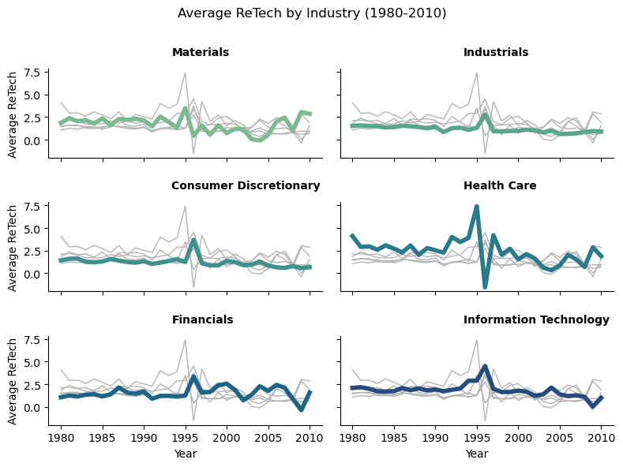
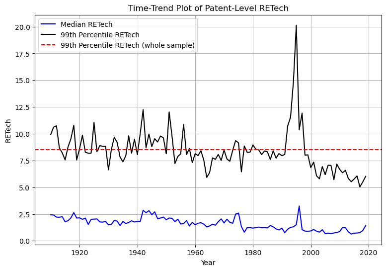

---
layout: wide_default
---  
# Assignment 4: Merging

This assignment requires you to 
- Explore some new data on patents
- Implement merges according to [best practices](https://ledatascifi.github.io/ledatascifi-2024/content/03/05b_merging.html#merging-in-new-variables-to-your-analysis)
- I did not include questions explicitly aimed at [Merging in new variables to your analysis](https://ledatascifi.github.io/ledatascifi-2024/content/03/05b_merging.html#merging-in-new-variables-to-your-analysis) or [Create your variables before a merge when possible](https://ledatascifi.github.io/ledatascifi-2024/content/03/05b_merging.html#create-your-variables-before-a-merge-when-possible), but **you should read those** because they will matter for the midterm project and your group projects a lot!
  - I removed questions on these topics to lighten the assignment burden, but don't infer a lack of import: These are very important skills!


```python
import pandas as pd
import numpy as np
import matplotlib.pyplot as plt
import pandas_datareader as pdr
import seaborn as sns
import warnings

# these three are used to open the CCM dataset:
from io import BytesIO
from zipfile import ZipFile
from urllib.request import urlopen
```

## Download CCM data

This code comes from the textbook.

To get the URL, I [went to the data repo and found it](https://github.com/LeDataSciFi/data/blob/main/Firm%20Year%20Datasets%20(Compustat)/CCM_cleaned_for_class.zip), and then I right clicked on the "Download" button and copied the link. 


```python
url = 'https://github.com/LeDataSciFi/ledatascifi-2024/blob/main/data/CCM_cleaned_for_class.zip?raw=true'

#ccm = pd.read_stata(url)   
# <-- that code would work if I had uploaded the data as a csv file, but GH said it was too big to upload 
# so I zipped it. We need a little workaround to download it:

with urlopen(url) as request:
    data = BytesIO(request.read())

with ZipFile(data) as archive:
    with archive.open(archive.namelist()[0]) as stata:
        ccm = pd.read_stata(stata)
```

## Firm year patent data.

We will use `firmyear_patstats.csv`. It's in the same place in the data repo as the CCM file. You will figure out how to download it _by script._ Don't download the file to your computer.  

It contains variables that we want to include in the  CCM dataset for analysis.

## PART 1

Insert cell(s) below this one as needed to finish this Part.

Load the following two datasets and answer these questions. Assume for these questions that the `ccm` data is the "left" dataset and the `firmyear_patstats` is the "right" dataset. 

1. How many observations are there in `ccm` data?
1. How many observations are there in `firmyear_patstats` data?
4. After an inner merge?
1. How many observations are there after a left merge?
2. After a right merge? 
3. After an outer merge? 
1. Why isn't the answer to Q4 and Q5 the same?
1. Is this a 1:1, 1:M, M:1, or M:M merge?

Remember: Specify `how`, `on`, `indicator=True`, and `validate` on each merge!


```python
url = 'https://raw.githubusercontent.com/LeDataSciFi/data/main/Firm%20Year%20Datasets%20(Compustat)/firmyear_patstats.csv'
firmyear_patstats = pd.read_csv(url)
firmyear_patstats.head()
```


<div>
<style scoped>
    .dataframe tbody tr th:only-of-type {
        vertical-align: middle;
    }

    .dataframe tbody tr th {
        vertical-align: top;
    }

    .dataframe thead th {
        text-align: right;
    }
</style>
<table border="1" class="dataframe">
  <thead>
    <tr style="text-align: right;">
      <th></th>
      <th>gvkey</th>
      <th>ayear</th>
      <th>patent_app_count</th>
      <th>RETech_avg</th>
    </tr>
  </thead>
  <tbody>
    <tr>
      <th>0</th>
      <td>1000</td>
      <td>1974</td>
      <td>2</td>
      <td>1.282584</td>
    </tr>
    <tr>
      <th>1</th>
      <td>1000</td>
      <td>1975</td>
      <td>2</td>
      <td>1.309539</td>
    </tr>
    <tr>
      <th>2</th>
      <td>1000</td>
      <td>1976</td>
      <td>2</td>
      <td>1.099830</td>
    </tr>
    <tr>
      <th>3</th>
      <td>1004</td>
      <td>1979</td>
      <td>1</td>
      <td>0.462650</td>
    </tr>
    <tr>
      <th>4</th>
      <td>1004</td>
      <td>1981</td>
      <td>1</td>
      <td>2.276393</td>
    </tr>
  </tbody>
</table>
</div>


```python
ccm.head() # overlapping columns: gvkey
```


<div>
<style scoped>
    .dataframe tbody tr th:only-of-type {
        vertical-align: middle;
    }

    .dataframe tbody tr th {
        vertical-align: top;
    }

    .dataframe thead th {
        text-align: right;
    }
</style>
<table border="1" class="dataframe">
  <thead>
    <tr style="text-align: right;">
      <th></th>
      <th>gvkey</th>
      <th>fyear</th>
      <th>datadate</th>
      <th>lpermno</th>
      <th>gsector</th>
      <th>sic</th>
      <th>sic3</th>
      <th>age</th>
      <th>tic</th>
      <th>state</th>
      <th>...</th>
      <th>tnic3hhi</th>
      <th>tnic3tsimm</th>
      <th>prodmktfluid</th>
      <th>delaycon</th>
      <th>equitydelaycon</th>
      <th>debtdelaycon</th>
      <th>privdelaycon</th>
      <th>l_emp</th>
      <th>l_ppent</th>
      <th>l_laborratio</th>
    </tr>
  </thead>
  <tbody>
    <tr>
      <th>0</th>
      <td>1000</td>
      <td>1975.0</td>
      <td>1975-12-31</td>
      <td>25881.0</td>
      <td></td>
      <td>3089.0</td>
      <td>308.0</td>
      <td>0.0</td>
      <td>AE.2</td>
      <td></td>
      <td>...</td>
      <td>NaN</td>
      <td>NaN</td>
      <td>NaN</td>
      <td>NaN</td>
      <td>NaN</td>
      <td>NaN</td>
      <td>NaN</td>
      <td>0.719789</td>
      <td>2.111788</td>
      <td>1.930200</td>
    </tr>
    <tr>
      <th>1</th>
      <td>1000</td>
      <td>1976.0</td>
      <td>1976-12-31</td>
      <td>25881.0</td>
      <td></td>
      <td>3089.0</td>
      <td>308.0</td>
      <td>1.0</td>
      <td>AE.2</td>
      <td></td>
      <td>...</td>
      <td>NaN</td>
      <td>NaN</td>
      <td>NaN</td>
      <td>NaN</td>
      <td>NaN</td>
      <td>NaN</td>
      <td>NaN</td>
      <td>0.900161</td>
      <td>2.858766</td>
      <td>2.421281</td>
    </tr>
    <tr>
      <th>2</th>
      <td>1000</td>
      <td>1977.0</td>
      <td>1977-12-31</td>
      <td>25881.0</td>
      <td></td>
      <td>3089.0</td>
      <td>308.0</td>
      <td>2.0</td>
      <td>AE.2</td>
      <td></td>
      <td>...</td>
      <td>NaN</td>
      <td>NaN</td>
      <td>NaN</td>
      <td>NaN</td>
      <td>NaN</td>
      <td>NaN</td>
      <td>NaN</td>
      <td>1.008323</td>
      <td>3.040562</td>
      <td>2.437114</td>
    </tr>
    <tr>
      <th>3</th>
      <td>1001</td>
      <td>1983.0</td>
      <td>1983-12-31</td>
      <td>10015.0</td>
      <td>25</td>
      <td>5812.0</td>
      <td>581.0</td>
      <td>0.0</td>
      <td>AMFD.</td>
      <td>OK</td>
      <td>...</td>
      <td>NaN</td>
      <td>NaN</td>
      <td>NaN</td>
      <td>NaN</td>
      <td>NaN</td>
      <td>NaN</td>
      <td>NaN</td>
      <td>0.869618</td>
      <td>2.255074</td>
      <td>1.817871</td>
    </tr>
    <tr>
      <th>4</th>
      <td>1001</td>
      <td>1984.0</td>
      <td>1984-12-31</td>
      <td>10015.0</td>
      <td>25</td>
      <td>5812.0</td>
      <td>581.0</td>
      <td>1.0</td>
      <td>AMFD.</td>
      <td>OK</td>
      <td>...</td>
      <td>NaN</td>
      <td>NaN</td>
      <td>NaN</td>
      <td>NaN</td>
      <td>NaN</td>
      <td>NaN</td>
      <td>NaN</td>
      <td>0.917090</td>
      <td>2.618490</td>
      <td>2.135985</td>
    </tr>
  </tbody>
</table>
<p>5 rows × 43 columns</p>
</div>


```python
# process the data
ccm_df = ccm.copy()
ccm_df['year'] = ccm_df['fyear'].astype(int)
ccm_df.drop(columns=['fyear'], inplace=True)
firmyear_patstats_df = firmyear_patstats.copy()
firmyear_patstats_df['year'] = firmyear_patstats_df['ayear'].astype(int)
firmyear_patstats_df.drop(columns=['ayear'], inplace=True)
```


```python
# question 1
print("There are", len(ccm_df), "observations in the CCM dataset")
# question 2
print("There are", len(firmyear_patstats_df), "observations in the firmyear_patstats dataset")
# question 3
inner_merged_df = ccm_df.merge(firmyear_patstats_df, how='inner', on=['gvkey', 'year'], indicator=True, validate='1:1')
print("There are", len(inner_merged_df), "observations in the dataset after inner merge")
# question 4
left_merged_df = ccm_df.merge(firmyear_patstats_df, how='left', on=['gvkey', 'year'], indicator=True, validate='1:1')  
print("There are", len(left_merged_df), "observations in the dataset after left merge")
# question 5
right_merged_df = ccm_df.merge(firmyear_patstats_df, how='right', on=['gvkey', 'year'], indicator=True, validate='1:1')
print("There are", len(right_merged_df), "observations in the dataset after right merge")
# question 6
outer_merged_df = ccm_df.merge(firmyear_patstats_df, how='outer', on=['gvkey', 'year'], indicator=True, validate='1:1')
print("There are", len(outer_merged_df), "observations in the dataset after outer merge")

```

    There are 223001 observations in the CCM dataset
    There are 86380 observations in the firmyear_patstats dataset
    There are 49130 observations in the dataset after inner merge
    There are 223001 observations in the dataset after left merge
    There are 86380 observations in the dataset after right merge
    There are 260251 observations in the dataset after outer merge


**Question 7**

The answer to question 4 and 5 is not the same because left and right merge is not the same. Left merge keeps all the observations in the left dataset and only the observations in the right dataset that have a match in the left dataset. Right merge keeps all the observations in the right dataset and only the observations in the left dataset that have a match in the right dataset. In this case, the `ccm` data has more unmatched observations than the `firmyear_patstats` data. 

**Question 8**

All of these are 1:1 merge because the `ccm` and `firmyear_patstats` data have a single observation for each firm-year.

## Part 2: Industry patenting trends

- Reduce the data to gsectors 15, 35, 20, 45, 40, 25, and years 1980-2010.
- Calculate the average **patent-level** RETech across **patents (not firm years)** for each industry-year 
    - Gsector 15 will have a value for 1980, and 1981, Gsector 35 will have a value for 1980, and 1981, and so on...
    - **Be thoughtful about how you compute this from the firmyear_patstats df.** There is a correct answer. Don't ask questions about this on the discussion board. 
- Q9. Print out the year 2000 industry averages you just computed. This is a checkpoint for grading.
- Q10. Plot the time-trends of the industry averages 
    - 2%: Set the title, xlabel, and ylabel
    - 2%: There should be no error bands showing
    - 4%: Replace the gsector numbers with the names of the industries
    - 3% of the total grade of the assignment will be reserved for implementing [the "sparkline" style of graph ](https://github.com/LeDataSciFi/ledatascifi-2024/discussions/15#discussioncomment-8548094) several students made for Assignment 3.
        - Because of how I chose to structure the data, I had to alter the code linked above to use hue instead of units, and [then correct the background line colors](https://stackoverflow.com/questions/67221399/plotting-multiple-lines-with-same-color-but-using-hue-to-separate-the-lines).
        - It's possible my tweaks can be avoided. 


```python
# convert gsector to int64 from object
inner_merged_df['gsector'] = pd.to_numeric(inner_merged_df['gsector'], downcast='integer')
# reduce the data to gsectors 15, 35, 20, 45, 40, 25, and years 1980-2010.
reduced_df = inner_merged_df[(inner_merged_df['gsector'].isin([15, 35, 20, 45, 40, 25])) & (inner_merged_df['year'] >= 1980) & (inner_merged_df['year'] <= 2010)]
# drop rows with missing values in the relevant columns
reduced_df = reduced_df.dropna(subset=['gsector', 'year', 'RETech_avg'])
# keep only the relevant columns
reduced_df = reduced_df[['gsector', 'year', 'RETech_avg', 'patent_app_count']]
# calculate the total ReTech
reduced_df['total_retech'] = reduced_df['RETech_avg'] * reduced_df['patent_app_count']
# group by year and gsector
reduced_df = reduced_df.groupby(['gsector', 'year']).agg({'total_retech': 'sum', 'patent_app_count': 'sum'}).reset_index()
# calculate the average ReTech
reduced_df['avg_retech'] = reduced_df['total_retech'] / reduced_df['patent_app_count']
```


```python
# question 9: print the year 2000 industry averages
reduced_df[reduced_df['year'] == 2000] 
```


<div>
<style scoped>
    .dataframe tbody tr th:only-of-type {
        vertical-align: middle;
    }

    .dataframe tbody tr th {
        vertical-align: top;
    }

    .dataframe thead th {
        text-align: right;
    }
</style>
<table border="1" class="dataframe">
  <thead>
    <tr style="text-align: right;">
      <th></th>
      <th>gsector</th>
      <th>year</th>
      <th>total_retech</th>
      <th>patent_app_count</th>
      <th>avg_retech</th>
    </tr>
  </thead>
  <tbody>
    <tr>
      <th>20</th>
      <td>15.0</td>
      <td>2000</td>
      <td>2417.634396</td>
      <td>3365</td>
      <td>0.718465</td>
    </tr>
    <tr>
      <th>51</th>
      <td>20.0</td>
      <td>2000</td>
      <td>8036.647959</td>
      <td>8345</td>
      <td>0.963049</td>
    </tr>
    <tr>
      <th>82</th>
      <td>25.0</td>
      <td>2000</td>
      <td>17281.617778</td>
      <td>12667</td>
      <td>1.364302</td>
    </tr>
    <tr>
      <th>113</th>
      <td>35.0</td>
      <td>2000</td>
      <td>9646.464090</td>
      <td>6262</td>
      <td>1.540477</td>
    </tr>
    <tr>
      <th>144</th>
      <td>40.0</td>
      <td>2000</td>
      <td>485.838867</td>
      <td>189</td>
      <td>2.570576</td>
    </tr>
    <tr>
      <th>175</th>
      <td>45.0</td>
      <td>2000</td>
      <td>70492.062749</td>
      <td>39240</td>
      <td>1.796434</td>
    </tr>
  </tbody>
</table>
</div>


```python
# add industry names to the dataset
reduced_df['industry'] = reduced_df['gsector'].replace([15, 20, 25, 35, 40, 45], ['Materials', 'Industrials', 'Consumer Discretionary', 'Health Care', 'Financials', 'Information Technology'])

# question 10: plot the time trends of the industry averages
warnings.filterwarnings("ignore", "use_inf_as_na")
g = sns.relplot(
    data=reduced_df,
    x='year', y='avg_retech', col="industry", hue="industry",
    kind="line", palette="crest", linewidth=4, zorder=5,
    col_wrap=2, height=2, aspect=2, legend=False,
)

# Iterate over each subplot to customize further
for year, ax in g.axes_dict.items():

    # Add the title as an annotation within the plot
    ax.text(.45, 1.15, year, transform=ax.transAxes, fontweight="bold")

    # Plot every year's time series in the background
    sns.lineplot(
        data=reduced_df, x='year', y='avg_retech', units="industry",
        estimator=None, color=".7", linewidth=1, ax=ax,
    )
    

# Tweak the supporting aspects of the plot
g.set_titles("")
g.set_axis_labels("Year", "Average ReTech")
g.fig.suptitle('Average ReTech by Industry (1980-2010)')
g.fig.subplots_adjust(top = .85, hspace = 0.5)
```


    

    


## Part 3: Outliers

Let's consider if patent-level RETech should be winsorized for any analysis, and if so, how to define the limits. 

- Download the patent-level RETech data. This is not the dataset above. You'll figure it out :)
- Q11: Make one time-trend plot (use the application year for each patent, not the grant year for the time variable), covering all years in the data, with three lines:
    - Median RETech for each year (blue line)
    - 99th percentile RETech for each year (black line)
    - 99th percentile of RETech over the whole sample, a number computed over the entire sample at once (red line)
- Q12:  Short answer (<5 sentences): Discuss the difference between the red line and the black line, and what they imply for your choice of winsorization limits. 
    - If you winsorize RETech based on the black line, how is that different from winsorizing based on the red line?


```python
data = pd.read_csv('Pat_text_vars_NotWinsored.csv')
data.head()
```


<div>
<style scoped>
    .dataframe tbody tr th:only-of-type {
        vertical-align: middle;
    }

    .dataframe tbody tr th {
        vertical-align: top;
    }

    .dataframe thead th {
        text-align: right;
    }
</style>
<table border="1" class="dataframe">
  <thead>
    <tr style="text-align: right;">
      <th></th>
      <th>pnum</th>
      <th>RETech</th>
      <th>ayear</th>
      <th>Breadth</th>
      <th>gyear</th>
      <th>nber</th>
    </tr>
  </thead>
  <tbody>
    <tr>
      <th>0</th>
      <td>948419</td>
      <td>5.328984</td>
      <td>1910</td>
      <td>0.488365</td>
      <td>1910</td>
      <td>5.0</td>
    </tr>
    <tr>
      <th>1</th>
      <td>948819</td>
      <td>2.177653</td>
      <td>1910</td>
      <td>0.606481</td>
      <td>1910</td>
      <td>1.0</td>
    </tr>
    <tr>
      <th>2</th>
      <td>948933</td>
      <td>2.690911</td>
      <td>1910</td>
      <td>0.512051</td>
      <td>1910</td>
      <td>5.0</td>
    </tr>
    <tr>
      <th>3</th>
      <td>949133</td>
      <td>1.602156</td>
      <td>1910</td>
      <td>0.242670</td>
      <td>1910</td>
      <td>6.0</td>
    </tr>
    <tr>
      <th>4</th>
      <td>949323</td>
      <td>3.692074</td>
      <td>1910</td>
      <td>0.285375</td>
      <td>1910</td>
      <td>6.0</td>
    </tr>
  </tbody>
</table>
</div>


**Question 11**


```python
# 99th percentile of RETech over the whole sample, a number computed over the entire sample
retech_99th = data['RETech'].quantile(0.99)
# Median RETech for each year
median_retech = data.groupby('ayear')['RETech'].median()
# 99th percentile RETech for each year
retech_99th_yearly = data.groupby('ayear')['RETech'].quantile(0.99)
# plot the trend lines for the 3 variables
plt.figure(figsize=(9, 6))
plt.plot(median_retech, label='Median RETech', color='blue')
plt.plot(retech_99th_yearly, label='99th Percentile RETech', color='black')
plt.axhline(y=retech_99th, color='red', linestyle='--', label='99th Percentile RETech (whole sample)')
plt.legend()
# set labels and title
plt.xlabel('Year')
plt.ylabel('RETech')
plt.title('Time-Trend Plot of Patent-Level RETech')
plt.grid(True)  
plt.show()
```


    

    


**Question 12**

The black line represents the 99th percentile RETech for each year, while the red line represents the 99th percentile of RETech over the whole sample. Winsorizing RETech based on the black line means capping extreme values at the 99th percentile for each year, which adjusts for year-specific variations. Conversely, winsorizing based on the red line applies a uniform cap across all years, disregarding year-specific fluctuations. Choosing winsorization limits based on the black line allows for adaptation to yearly variations, potentially capturing more nuanced trends, whereas using the red line imposes a consistent limit irrespective of yearly dynamics, which could obscure variability in the data.

## Bonus: Ungraded, hard, but useful on the next assignment/midterm

Your goal is to end up with a dataset with these variables:
- ticker
- date
- ret
- HARD: days_since_filing 
- HARDER: trading_days_since_filing (0 on the filing date or the first trading day after it)

You can filter the resulting data to only observations where `abs(days_since_filing)<=10`.

This is the foundamental structure we need to do an "event study". 

You'll do this by using the datasets below. 

HINT: `merge` won't work, because JJSF's filing date (when it releases its 10-K) is not a trading date. 


```python
data = {
    'ticker': ['JJSF']*20 + ['TSLA']*20,
    'date': ['2021-12-01', '2021-12-02', '2021-12-03', '2021-12-06', '2021-12-07', '2021-12-08', '2021-12-09', '2021-12-10', '2021-12-13', '2021-12-14', '2021-12-15', '2021-12-16', '2021-12-17', '2021-12-20', '2021-12-21', '2021-12-22', '2021-12-23', '2021-12-27', '2021-12-28', '2021-12-29'] + ['2022-12-02', '2022-12-05', '2022-12-06', '2022-12-07', '2022-12-08', '2022-12-09', '2022-12-12', '2022-12-13', '2022-12-14', '2022-12-15', '2022-12-16', '2022-12-19', '2022-12-20', '2022-12-21', '2022-12-22', '2022-12-23', '2022-12-27', '2022-12-28', '2022-12-29', '2022-12-30'],
    'ret': [-0.011276, 0.030954, 0.000287, 0.014362, 0.012459, 0.017200, -0.010173, 0.011875, 0.012559, 0.002508, 0.022852, 0.012360, 0.017387, -0.008957, 0.016840, -0.000256, -0.002558, 0.009041, -0.002097, 0.010189] + [0.000822, -0.063687, -0.014415, -0.032143, -0.003447, 0.032345, -0.062720, -0.040937, -0.025784, 0.005548, -0.047187, -0.002396, -0.080536, -0.001669, -0.088828, -0.017551, -0.114089, 0.033089, 0.080827, 0.011164]
}

crsp = pd.DataFrame(data)
crsp['date'] = pd.to_datetime(crsp['date'])

fake_filings = pd.DataFrame({'ticker':['JJSF','TSLA'],
                             'filing_date':['2021-12-04','2022-12-13']})
```
