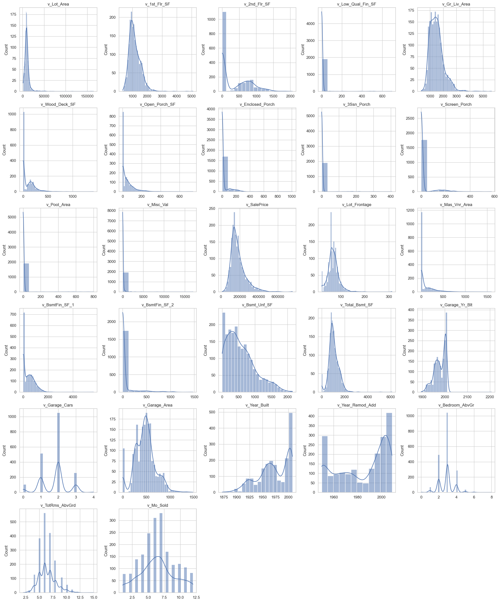
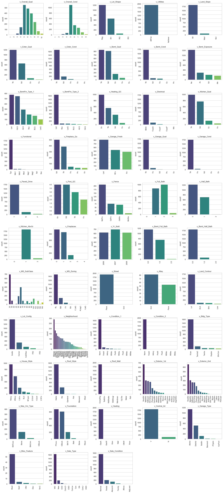
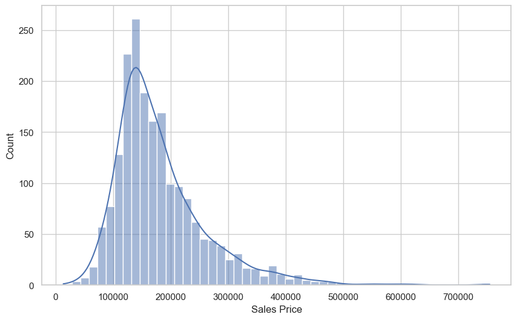
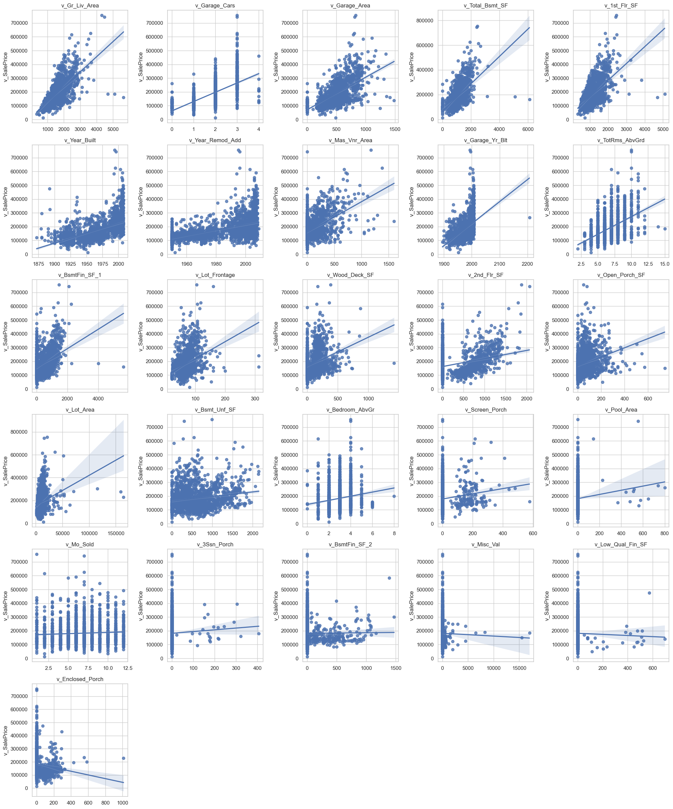
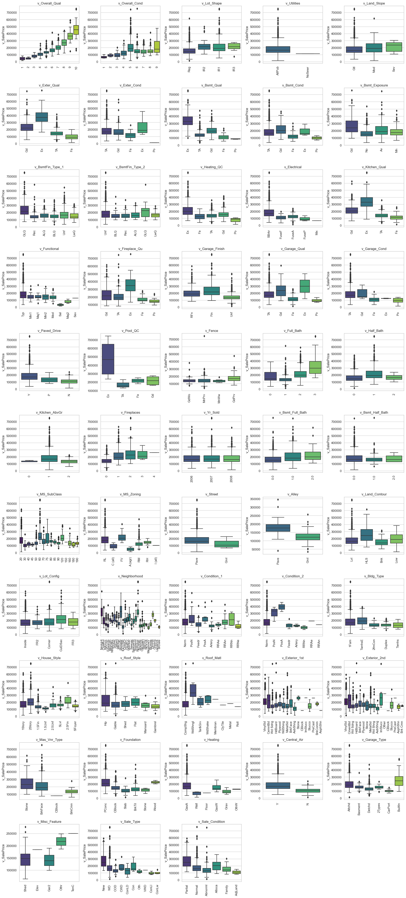

## Part 1: EDA

_Insert cells as needed below to write a short EDA/data section that summarizes the data for someone who has never opened it before._ 
- Answer essential questions about the dataset (observation units, time period, sample size, many of the questions above) 
- Note any issues you have with the data (variable X has problem Y that needs to get addressed before using it in regressions or a prediction model because Z)
- Present any visual results you think are interesting or important


```python
# load libraries
import pandas as pd
from statsmodels.formula.api import ols as sm_ols
import numpy as np
import seaborn as sns
import matplotlib.pyplot as plt
from statsmodels.iolib.summary2 import summary_col # nicer tables
import warnings
warnings.filterwarnings("ignore", "use_inf_as_na")
```


```python
# load data
housing_data = pd.read_csv('input_data2/housing_train.csv')
housing_data.head()
```


<div>
<style scoped>
    .dataframe tbody tr th:only-of-type {
        vertical-align: middle;
    }

    .dataframe tbody tr th {
        vertical-align: top;
    }

    .dataframe thead th {
        text-align: right;
    }
</style>
<table border="1" class="dataframe">
  <thead>
    <tr style="text-align: right;">
      <th></th>
      <th>parcel</th>
      <th>v_MS_SubClass</th>
      <th>v_MS_Zoning</th>
      <th>v_Lot_Frontage</th>
      <th>v_Lot_Area</th>
      <th>v_Street</th>
      <th>v_Alley</th>
      <th>v_Lot_Shape</th>
      <th>v_Land_Contour</th>
      <th>v_Utilities</th>
      <th>...</th>
      <th>v_Pool_Area</th>
      <th>v_Pool_QC</th>
      <th>v_Fence</th>
      <th>v_Misc_Feature</th>
      <th>v_Misc_Val</th>
      <th>v_Mo_Sold</th>
      <th>v_Yr_Sold</th>
      <th>v_Sale_Type</th>
      <th>v_Sale_Condition</th>
      <th>v_SalePrice</th>
    </tr>
  </thead>
  <tbody>
    <tr>
      <th>0</th>
      <td>1056_528110080</td>
      <td>20</td>
      <td>RL</td>
      <td>107.0</td>
      <td>13891</td>
      <td>Pave</td>
      <td>NaN</td>
      <td>Reg</td>
      <td>Lvl</td>
      <td>AllPub</td>
      <td>...</td>
      <td>0</td>
      <td>NaN</td>
      <td>NaN</td>
      <td>NaN</td>
      <td>0</td>
      <td>1</td>
      <td>2008</td>
      <td>New</td>
      <td>Partial</td>
      <td>372402</td>
    </tr>
    <tr>
      <th>1</th>
      <td>1055_528108150</td>
      <td>20</td>
      <td>RL</td>
      <td>98.0</td>
      <td>12704</td>
      <td>Pave</td>
      <td>NaN</td>
      <td>Reg</td>
      <td>Lvl</td>
      <td>AllPub</td>
      <td>...</td>
      <td>0</td>
      <td>NaN</td>
      <td>NaN</td>
      <td>NaN</td>
      <td>0</td>
      <td>1</td>
      <td>2008</td>
      <td>New</td>
      <td>Partial</td>
      <td>317500</td>
    </tr>
    <tr>
      <th>2</th>
      <td>1053_528104050</td>
      <td>20</td>
      <td>RL</td>
      <td>114.0</td>
      <td>14803</td>
      <td>Pave</td>
      <td>NaN</td>
      <td>Reg</td>
      <td>Lvl</td>
      <td>AllPub</td>
      <td>...</td>
      <td>0</td>
      <td>NaN</td>
      <td>NaN</td>
      <td>NaN</td>
      <td>0</td>
      <td>6</td>
      <td>2008</td>
      <td>New</td>
      <td>Partial</td>
      <td>385000</td>
    </tr>
    <tr>
      <th>3</th>
      <td>2213_909275160</td>
      <td>20</td>
      <td>RL</td>
      <td>126.0</td>
      <td>13108</td>
      <td>Pave</td>
      <td>NaN</td>
      <td>IR2</td>
      <td>HLS</td>
      <td>AllPub</td>
      <td>...</td>
      <td>0</td>
      <td>NaN</td>
      <td>NaN</td>
      <td>NaN</td>
      <td>0</td>
      <td>6</td>
      <td>2007</td>
      <td>WD</td>
      <td>Normal</td>
      <td>153500</td>
    </tr>
    <tr>
      <th>4</th>
      <td>1051_528102030</td>
      <td>20</td>
      <td>RL</td>
      <td>96.0</td>
      <td>12444</td>
      <td>Pave</td>
      <td>NaN</td>
      <td>Reg</td>
      <td>Lvl</td>
      <td>AllPub</td>
      <td>...</td>
      <td>0</td>
      <td>NaN</td>
      <td>NaN</td>
      <td>NaN</td>
      <td>0</td>
      <td>11</td>
      <td>2008</td>
      <td>New</td>
      <td>Partial</td>
      <td>394617</td>
    </tr>
  </tbody>
</table>
<p>5 rows × 81 columns</p>
</div>


### 1. Sample Basics
The dataset contains data about house sales in Ames, Iowa. The dataset contains 1941 observations and 81 variables. The unit of observation is a house that is sold, with `parcel` variable as the unique identifier. The time period of the home sales spans from 2006 to 2008. 

Below is a list of the variables in the dataset (excluding `parcel`), categorized by type:

- **46 Categorical Variables**: 
    - **23 Ordinal**: v_Overall_Qual, v_Overall_Cond, v_Lot_Shape, v_Utilities, v_Land_Slope, v_Exter_Qual, v_Exter_Cond, v_Bsmt_Qual, v_Bsmt_Cond, v_Bsmt_Exposure, v_BsmtFin_Type_1, v_BsmtFin_Type_2, v_Heating_QC, v_Electrical, v_Kitchen_Qual, v_Functional, v_Fireplace_Qu, v_Garage_Finish, v_Garage_Qual, v_Garage_Cond, v_Paved_Drive, v_Pool_QC, v_Fence
    - **23 Nominal**: v_MS_SubClass, v_MS_Zoning, v_Street, v_Alley, v_Land_Contour, v_Lot_Config, v_Neighborhood, v_Condition_1, v_Condition_2, v_Bldg_Type, v_House_Style, v_Roof_Style, v_Roof_Matl, v_Exterior_1st, v_Exterior_2nd, v_Mas_Vnr_Type, v_Foundation, v_Heating, v_Central_Air, v_Garage_Type, v_Misc_Feature, v_Sale_Type, v_Sale_Condition

- **12 Discreet Variables**: v_Year_Built, v_Year_Remod_Add, v_Full_Bath, v_Half_Bath, v_Bedroom_AbvGr, v_Kitchen_AbvGr, v_TotRms_AbvGrd, v_Fireplaces, v_Mo_Sold, v_Yr_Sold, v_Bsmt_Full_Bath, v_Bsmt_Half_Bath
  
- **22 Continuous Variables**: v_Lot_Area, v_1st_Flr_SF, v_2nd_Flr_SF, v_Low_Qual_Fin_SF, v_Gr_Liv_Area, v_Wood_Deck_SF, v_Open_Porch_SF, v_Enclosed_Porch, v_3Ssn_Porch, v_Screen_Porch, v_Pool_Area, v_Misc_Val, v_SalePrice, v_Lot_Frontage, v_Mas_Vnr_Area, v_BsmtFin_SF_1, v_BsmtFin_SF_2, v_Bsmt_Unf_SF, v_Total_Bsmt_SF, v_Garage_Yr_Blt, v_Garage_Cars, v_Garage_Area

Ordinal vs Nominal Variables: The ordinal variables have a meaningful order, while the nominal variables do not. 

We can treat discreet variables as either continuous or categorical depending on how many levels they have and the context of the data. For this analysis, I will treat them as continuous variables if they have more than 5 levels and as categorical if they have 5 or fewer levels.


```python
# save the type of the variables for later use
ordinal_vars = ['v_Overall_Qual', 'v_Overall_Cond', 'v_Lot_Shape', 'v_Utilities', 'v_Land_Slope', 'v_Exter_Qual', 'v_Exter_Cond', 'v_Bsmt_Qual', 'v_Bsmt_Cond', 'v_Bsmt_Exposure', 'v_BsmtFin_Type_1', 'v_BsmtFin_Type_2', 'v_Heating_QC', 'v_Electrical', 'v_Kitchen_Qual', 'v_Functional', 'v_Fireplace_Qu', 'v_Garage_Finish', 'v_Garage_Qual', 'v_Garage_Cond', 'v_Paved_Drive', 'v_Pool_QC', 'v_Fence']
nominal_vars = ['v_MS_SubClass', 'v_MS_Zoning', 'v_Street', 'v_Alley', 'v_Land_Contour', 'v_Lot_Config', 'v_Neighborhood', 'v_Condition_1', 'v_Condition_2', 'v_Bldg_Type', 'v_House_Style', 'v_Roof_Style', 'v_Roof_Matl', 'v_Exterior_1st', 'v_Exterior_2nd', 'v_Mas_Vnr_Type', 'v_Foundation', 'v_Heating', 'v_Central_Air', 'v_Garage_Type', 'v_Misc_Feature', 'v_Sale_Type', 'v_Sale_Condition']
discreet_vars = ['v_Year_Built', 'v_Year_Remod_Add', 'v_Full_Bath', 'v_Half_Bath', 'v_Bedroom_AbvGr', 'v_Kitchen_AbvGr', 'v_TotRms_AbvGrd', 'v_Fireplaces', 'v_Mo_Sold', 'v_Yr_Sold', 'v_Bsmt_Full_Bath', 'v_Bsmt_Half_Bath']
continuous_vars = ['v_Lot_Area', 'v_1st_Flr_SF', 'v_2nd_Flr_SF', 'v_Low_Qual_Fin_SF', 'v_Gr_Liv_Area', 'v_Wood_Deck_SF', 'v_Open_Porch_SF', 'v_Enclosed_Porch', 'v_3Ssn_Porch', 'v_Screen_Porch', 'v_Pool_Area', 'v_Misc_Val', 'v_SalePrice', 'v_Lot_Frontage', 'v_Mas_Vnr_Area', 'v_BsmtFin_SF_1', 'v_BsmtFin_SF_2', 'v_Bsmt_Unf_SF', 'v_Total_Bsmt_SF', 'v_Garage_Yr_Blt', 'v_Garage_Cars', 'v_Garage_Area']

# change v_Year_Remod/Add to v_Year_Remod_Add
housing_data = housing_data.rename(columns={'v_Year_Remod/Add': 'v_Year_Remod_Add'})

# categorize discrete variables: if it has > 5 levels, it is considered continuous, otherwise it is considered ordinal
for var in discreet_vars:
    if len(housing_data[var].unique()) > 5:
        continuous_vars.append(var)
    else:
        ordinal_vars.append(var)
```

### 2. Outliers, Missing Values, and Data Errors
#### Outliers

To identify outliers, we will plot histograms for the numerical variables (continuous and discreet) and bar plots for the categorical variables. 


```python
sns.set(style = 'whitegrid')

# plot numerical variables
num_continuous_vars = len(continuous_vars)
num_continuous_rows = (num_continuous_vars - 1) // 5 + 1
num_continuous_cols = min(num_continuous_vars, 5)

plt.figure(figsize=(20, 4 * num_continuous_rows))
for i, var in enumerate(continuous_vars):
    plt.subplot(num_continuous_rows, num_continuous_cols, i+1)
    sns.histplot(housing_data[var].dropna(), kde=True).set(xlabel=None)
    plt.title(var)
plt.tight_layout()
plt.show()
```


    

    


**Some interesting observations:**
- The month that a house is sold (`v_Mo_Sold`) has its peak in the summer months (June and July).
- There are a lot of houses built around the year 2000.
- Most houses have no second floor (`v_2nd_Flr_SF`), low quality finished area (`v_Low_Qual_Fin_SF`), wood deck (`v_Wood_Deck_SF`), open porch (`v_Open_Porch_SF`), enclosed porch (`v_Enclosed_Porch`), 3 season porch (`v_3Ssn_Porch`), screen porch (`v_Screen_Porch`), pool area (`v_Pool_Area`), miscellaneous feature (`v_Misc_Val`), masonry veneer area (`v_Mas_Vnr_Area`), basement finished area type 1 (`v_BsmtFin_SF_1`),and basement finished area type 2 (`v_BsmtFin_SF_2`) - these variables have a peak at 0. Therefore, those houses with non-zero values for these variables are outliers.
- Most houses have the capacity for 2 cars in the garage (`v_Garage_Cars`), 3 bedrooms above grade (`v_Bedroom_AbvGr`), and 6 rooms above grade (`v_TotRms_AbvGrd`).


```python
# plot categorical variables
num_categorical_vars = len(ordinal_vars + nominal_vars)
num_categorical_rows = (num_categorical_vars - 1) // 5 + 1
num_categorical_cols = min(num_categorical_vars, 5)

plt.figure(figsize=(20, 4 * num_categorical_rows))
for i, var in enumerate(ordinal_vars + nominal_vars):
    plt.subplot(num_categorical_rows, num_categorical_cols, i+1)
    sns.barplot(x=housing_data[var].value_counts().index, y=housing_data[var].value_counts(), palette='viridis').set(xlabel=None)
    plt.title(var)
    plt.xticks(rotation=90)
plt.tight_layout()
plt.show()
```


    

    


**Some interesting observations**:
- It's apparent that houses with an overall material and finish rating of 3 or lower, or 10 or higher (`v_Overall_Qual`), are outliers. Such properties are either too expensive or of exceptionally poor quality, making them unattractive to the majority of potential buyers.
- The prevailing trend suggests that most homes tend to exhibit average to good quality in various aspects such as the exterior, garage, basement, or kitchen. Therefore, properties with exceptionally poor or excellent quality in these areas are considered outliers.
- However, there is an interesting exception in the case of heating quality and condition, where the majority of properties exhibit an excellent rating.
- It's rare to see properties with moderately irregular (IR2) or irregular (IR3) shape (`v_Lot_Shape`)
- Almost all properties are connected to public utilities (AllPub), with only a single exception being of NoSewr type, and none relying solely on electricity and gas (NoSeWa) or electricity alone (ELO) (`v_Utilities`).
- Properties situated on severe slopes (`v_Land_Slope` and `v_Land_Contour`) are scarce, which is understandable.
- Almost all houses have 1 kitchen, with rare exceptions having 2 kitchens.
- Few houses have more than 2 full bathrooms (`v_Full_Bath`) and fireplaces (`v_Fireplaces`) and more than 1 basement full bathroom (`v_Bsmt_Full_Bath`) and half bathroom (`v_Bsmt_Half_Bath`).

#### Missing Values

There are 27 variables with missing values. Below is a a list of the variables with missing values and the percentage of missing values compared to the total number of observations:


```python
# table of missing values and its percentage
missing = housing_data.isnull().sum()
missing = missing[missing > 0]
missing_table = pd.concat([missing, missing / len(housing_data) * 100.0], axis=1)
missing_table.columns = ['# Missing', '% Missing']
missing_table.sort_values(by='# Missing', ascending=False)
```


<div>
<style scoped>
    .dataframe tbody tr th:only-of-type {
        vertical-align: middle;
    }

    .dataframe tbody tr th {
        vertical-align: top;
    }

    .dataframe thead th {
        text-align: right;
    }
</style>
<table border="1" class="dataframe">
  <thead>
    <tr style="text-align: right;">
      <th></th>
      <th># Missing</th>
      <th>% Missing</th>
    </tr>
  </thead>
  <tbody>
    <tr>
      <th>v_Pool_QC</th>
      <td>1928</td>
      <td>99.330242</td>
    </tr>
    <tr>
      <th>v_Misc_Feature</th>
      <td>1878</td>
      <td>96.754250</td>
    </tr>
    <tr>
      <th>v_Alley</th>
      <td>1805</td>
      <td>92.993302</td>
    </tr>
    <tr>
      <th>v_Fence</th>
      <td>1576</td>
      <td>81.195260</td>
    </tr>
    <tr>
      <th>v_Mas_Vnr_Type</th>
      <td>1172</td>
      <td>60.381247</td>
    </tr>
    <tr>
      <th>v_Fireplace_Qu</th>
      <td>940</td>
      <td>48.428645</td>
    </tr>
    <tr>
      <th>v_Lot_Frontage</th>
      <td>321</td>
      <td>16.537867</td>
    </tr>
    <tr>
      <th>v_Garage_Cond</th>
      <td>107</td>
      <td>5.512622</td>
    </tr>
    <tr>
      <th>v_Garage_Qual</th>
      <td>107</td>
      <td>5.512622</td>
    </tr>
    <tr>
      <th>v_Garage_Finish</th>
      <td>107</td>
      <td>5.512622</td>
    </tr>
    <tr>
      <th>v_Garage_Yr_Blt</th>
      <td>107</td>
      <td>5.512622</td>
    </tr>
    <tr>
      <th>v_Garage_Type</th>
      <td>105</td>
      <td>5.409583</td>
    </tr>
    <tr>
      <th>v_Bsmt_Exposure</th>
      <td>52</td>
      <td>2.679031</td>
    </tr>
    <tr>
      <th>v_Bsmt_Cond</th>
      <td>50</td>
      <td>2.575992</td>
    </tr>
    <tr>
      <th>v_Bsmt_Qual</th>
      <td>50</td>
      <td>2.575992</td>
    </tr>
    <tr>
      <th>v_BsmtFin_Type_1</th>
      <td>50</td>
      <td>2.575992</td>
    </tr>
    <tr>
      <th>v_BsmtFin_Type_2</th>
      <td>50</td>
      <td>2.575992</td>
    </tr>
    <tr>
      <th>v_Mas_Vnr_Area</th>
      <td>18</td>
      <td>0.927357</td>
    </tr>
    <tr>
      <th>v_Bsmt_Half_Bath</th>
      <td>2</td>
      <td>0.103040</td>
    </tr>
    <tr>
      <th>v_Bsmt_Full_Bath</th>
      <td>2</td>
      <td>0.103040</td>
    </tr>
    <tr>
      <th>v_BsmtFin_SF_1</th>
      <td>1</td>
      <td>0.051520</td>
    </tr>
    <tr>
      <th>v_Total_Bsmt_SF</th>
      <td>1</td>
      <td>0.051520</td>
    </tr>
    <tr>
      <th>v_Garage_Cars</th>
      <td>1</td>
      <td>0.051520</td>
    </tr>
    <tr>
      <th>v_Garage_Area</th>
      <td>1</td>
      <td>0.051520</td>
    </tr>
    <tr>
      <th>v_Bsmt_Unf_SF</th>
      <td>1</td>
      <td>0.051520</td>
    </tr>
    <tr>
      <th>v_BsmtFin_SF_2</th>
      <td>1</td>
      <td>0.051520</td>
    </tr>
    <tr>
      <th>v_Electrical</th>
      <td>1</td>
      <td>0.051520</td>
    </tr>
  </tbody>
</table>
</div>


As you can see, `v_Mas_Vnr_Type`, `v_Fence`, `v_Alley`, `v_MiscFeature`, `v_Fireplace_Qu`, and `v_PoolQC` variables have a substantial number of missing values (more than 50% of the observations).

#### Data Errors

We can see that 1 garage was in the year 2207, which is clearly an error! Since 2207 is similar to 2007, we can assume that this is a typo and correct it to 2007.


```python
housing_data['v_Garage_Yr_Blt'].value_counts().sort_index(ascending=False)
```


    v_Garage_Yr_Blt
    2207.0      1
    2008.0     22
    2007.0     93
    2006.0     99
    2005.0    110
             ... 
    1910.0      8
    1908.0      1
    1906.0      1
    1900.0      4
    1895.0      1
    Name: count, Length: 99, dtype: int64


### 3. Relationships between Sales Price vs. Other Variables

Before plotting the relationship between the sales price and other variables, we should look more closely into the distribution if the sales price. 


```python
plt.figure(figsize=(10, 6))
sns.histplot(housing_data['v_SalePrice'], kde=True, bins=50).set(xlabel="Sales Price")
plt.show()
```


    

    


```python
housing_data['v_SalePrice'].describe()
```


    count      1941.000000
    mean     182033.238022
    std       80407.100395
    min       13100.000000
    25%      130000.000000
    50%      161900.000000
    75%      215000.000000
    max      755000.000000
    Name: v_SalePrice, dtype: float64


It's clear to say that the distribution of sales price is skewed to the right with a good amount of outliers. The most expensive house is $755k and the least expensive house is $13.1k while the mean and median are ~$182k and ~$162k, respectively. Moreover, houses tend to vary in prices by $80k.

#### Continuous Variables vs. Sales Price


```python
correlation_table = housing_data[['v_SalePrice'] + continuous_vars].corr().iloc[0, 1:]
correlation_table = correlation_table.sort_values(ascending=False).iloc[1:]
correlation_table
```


    v_Gr_Liv_Area        0.715920
    v_Garage_Cars        0.641443
    v_Garage_Area        0.635800
    v_Total_Bsmt_SF      0.604760
    v_1st_Flr_SF         0.602053
    v_Year_Built         0.538535
    v_Year_Remod_Add     0.523806
    v_Mas_Vnr_Area       0.513664
    v_Garage_Yr_Blt      0.513269
    v_TotRms_AbvGrd      0.500723
    v_BsmtFin_SF_1       0.400426
    v_Lot_Frontage       0.354305
    v_Wood_Deck_SF       0.335227
    v_2nd_Flr_SF         0.316980
    v_Open_Porch_SF      0.290520
    v_Lot_Area           0.258027
    v_Bsmt_Unf_SF        0.183086
    v_Bedroom_AbvGr      0.154066
    v_Screen_Porch       0.132843
    v_Pool_Area          0.082397
    v_Mo_Sold            0.061142
    v_3Ssn_Porch         0.035341
    v_BsmtFin_SF_2       0.008726
    v_Misc_Val          -0.015668
    v_Low_Qual_Fin_SF   -0.021848
    v_Enclosed_Porch    -0.114574
    Name: v_SalePrice, dtype: float64


```python
# plot regression between continuous variables and SalePrice
plt.figure(figsize=(20, 4 * num_continuous_rows))
for i, var in enumerate(correlation_table.index):
    plt.subplot(num_continuous_rows, num_continuous_cols, i+1)
    sns.regplot(x=housing_data[var], y=housing_data['v_SalePrice']).set(xlabel=None)
    plt.title(var)
plt.tight_layout()
plt.show()
```


    

    


- Most continuous variable seems to have a linear relationship with the sales price.
- `v_Gr_Liv_Area` has the strongest positive correlation with `v_SalePrice` (0.72), followed by `v_Garage_Cars` (0.64), `v_Garage_Area` (0.64), `v_Total_Bsmt_SF` (0.60), and `v_1st_Flr_SF` (0.60). 
- For the variable `v_2nd_Flr_SF`, if we exclude the houses with no second floor (0 square feet), we can potentially see a stronger correlation with the sales price.
- Even though houses get sold the most in June and July, there is no relationship between the month of sale and the sales price.

#### Categorical Variables vs. Sales Price


```python
# plot boxplot for various levels of categorical variables (ordinal and nominal)
plt.figure(figsize=(20, 4 * num_categorical_rows))
for i, var in enumerate(ordinal_vars + nominal_vars):
    plt.subplot(num_categorical_rows, num_categorical_cols, i+1)
    sns.boxplot(x=var, y='v_SalePrice', data=housing_data, palette='viridis').set(xlabel=None)
    plt.title(var)
    plt.xticks(rotation=90)
plt.tight_layout()

```


    

    


- It's obvious to see that the sales price increase as the overall quality of the house increases (`v_Overall_Qual`). The trend applies to most other quality-related variables such as `v_Exter_Qual`, `v_Kitchen_Qual`, `v_Bsmt_Qual`, `v_Fireplace_Qu`, and `v_Garage_Qual`.
- The same trend can be observed for the overall condition of the house (`v_Overall_Cond`). However, houses with a condition rating of 5 have a higher median sales price than all other condition ratings. This may be due to the fact that most houses have a condition rating of 5, leading to wider variability in prices.
- Houses with irregular or moderately irregular lot shapes (`v_Lot_Shape`) tend to have higher median sales prices than those with regular lot shapes.
- Prices really vary by neighborhood (`v_Neighborhood`). Some neighborhoods have a median sales price of ~$350k, while others have a median sales price of $100k.
- The year the house was sold (`v_Yr_Sold`) does not seem to have a relationship with the sales price.

## Part 2: Running Regressions

**Run these regressions on the RAW data, even if you found data issues that you think should be addressed.**

_Insert cells as needed below to run these regressions. Note that $i$ is indexing a given house, and $t$ indexes the year of sale._ 

1. $\text{Sale Price}\_{i,t} = \alpha + \beta_1 * \text{v\_Lot\_Area}$
1. $\text{Sale Price}_{i,t} = \alpha + \beta_1 * log(\text{v\_Lot\_Area})$
1. $log(\text{Sale Price}_{i,t}) = \alpha + \beta_1 * \text{v\_Lot\_Area}$
1. $log(\text{Sale Price}_{i,t}) = \alpha + \beta_1 * log(\text{v\_Lot\_Area})$
1. $log(\text{Sale Price}_{i,t}) = \alpha + \beta_1 * \text{v\_Yr\_Sold}$
1. $log(\text{Sale Price}_{i,t}) = \alpha + \beta_1 * (\text{v\_Yr\_Sold==2007})+ \beta_2 * (\text{v\_Yr\_Sold==2008})$
1. Choose your own adventure: Pick any five variables from the dataset that you think will generate good R2. Use them in a regression of $log(\text{Sale Price}_{i,t})$ 
    - Tip: You can transform/create these five variables however you want, even if it creates extra variables. For example: I'd count Model 6 above as only using one variable: `v_Yr_Sold`.
    - I got an R2 of 0.877 with just "5" variables. How close can you get? I won't be shocked if someone beats that!
    

**Bonus formatting trick:** Instead of reporting all regressions separately, report all seven regressions in a _single_ table using `summary_col`.


```python
# find the best variables to predict SalePrice
r2_tables = []

for var in continuous_vars + ordinal_vars + nominal_vars:
    if var in continuous_vars:
        formula = f'np.log(v_SalePrice) ~ {var}'
    else:
        formula = f'np.log(v_SalePrice) ~ C({var})'

    reg = sm_ols(formula, data=housing_data).fit()

    if reg.rsquared > 0.3:
        r2_table = pd.DataFrame({'Variable': [var], 'R2': [reg.rsquared]})
        r2_tables.append(r2_table)

r2_table = pd.concat(r2_tables, ignore_index=True)
r2_table.sort_values(by='R2', ascending=False)

```


<div>
<style scoped>
    .dataframe tbody tr th:only-of-type {
        vertical-align: middle;
    }

    .dataframe tbody tr th {
        vertical-align: top;
    }

    .dataframe thead th {
        text-align: right;
    }
</style>
<table border="1" class="dataframe">
  <thead>
    <tr style="text-align: right;">
      <th></th>
      <th>Variable</th>
      <th>R2</th>
    </tr>
  </thead>
  <tbody>
    <tr>
      <th>2</th>
      <td>v_SalePrice</td>
      <td>0.900580</td>
    </tr>
    <tr>
      <th>9</th>
      <td>v_Overall_Qual</td>
      <td>0.687839</td>
    </tr>
    <tr>
      <th>17</th>
      <td>v_Neighborhood</td>
      <td>0.590658</td>
    </tr>
    <tr>
      <th>14</th>
      <td>v_Pool_QC</td>
      <td>0.578295</td>
    </tr>
    <tr>
      <th>1</th>
      <td>v_Gr_Liv_Area</td>
      <td>0.499974</td>
    </tr>
    <tr>
      <th>11</th>
      <td>v_Bsmt_Qual</td>
      <td>0.469620</td>
    </tr>
    <tr>
      <th>10</th>
      <td>v_Exter_Qual</td>
      <td>0.458746</td>
    </tr>
    <tr>
      <th>5</th>
      <td>v_Garage_Cars</td>
      <td>0.453507</td>
    </tr>
    <tr>
      <th>12</th>
      <td>v_Kitchen_Qual</td>
      <td>0.439010</td>
    </tr>
    <tr>
      <th>6</th>
      <td>v_Garage_Area</td>
      <td>0.423863</td>
    </tr>
    <tr>
      <th>3</th>
      <td>v_Total_Bsmt_SF</td>
      <td>0.370891</td>
    </tr>
    <tr>
      <th>15</th>
      <td>v_Full_Bath</td>
      <td>0.358043</td>
    </tr>
    <tr>
      <th>7</th>
      <td>v_Year_Built</td>
      <td>0.354138</td>
    </tr>
    <tr>
      <th>0</th>
      <td>v_1st_Flr_SF</td>
      <td>0.351212</td>
    </tr>
    <tr>
      <th>8</th>
      <td>v_Year_Remod_Add</td>
      <td>0.335058</td>
    </tr>
    <tr>
      <th>16</th>
      <td>v_MS_SubClass</td>
      <td>0.332211</td>
    </tr>
    <tr>
      <th>4</th>
      <td>v_Garage_Yr_Blt</td>
      <td>0.324336</td>
    </tr>
    <tr>
      <th>18</th>
      <td>v_Foundation</td>
      <td>0.307751</td>
    </tr>
    <tr>
      <th>13</th>
      <td>v_Garage_Finish</td>
      <td>0.306420</td>
    </tr>
  </tbody>
</table>
</div>


```python
reg1 = sm_ols('v_SalePrice ~ v_Lot_Area', data=housing_data).fit()
reg2 = sm_ols('v_SalePrice ~ np.log(v_Lot_Area)', data=housing_data).fit()
reg3 = sm_ols('np.log(v_SalePrice) ~ v_Lot_Area', data=housing_data).fit()
reg4 = sm_ols('np.log(v_SalePrice) ~ np.log(v_Lot_Area)', data=housing_data).fit()
reg5 = sm_ols('np.log(v_SalePrice) ~ v_Yr_Sold', data=housing_data).fit()
reg6 = sm_ols('np.log(v_SalePrice) ~ C(v_Yr_Sold)', data=housing_data).fit()
reg7 = sm_ols('np.log(v_SalePrice) ~ np.log(v_Gr_Liv_Area) + v_Garage_Cars + C(v_Neighborhood) * C(v_Overall_Qual) * C(v_Exter_Qual)', data=housing_data).fit()
```

I got rid of all the categorical variables in the summary table to make it more readable.


```python
# report all 7 regressions in a single table using summary_col
print('y = SalePrice if not specified, log(SalePrice) else')
result = (summary_col(results=[reg1, reg2, reg3, reg4, reg5, reg6, reg7],
                  float_format='%0.2f',
                  stars = True,
                  model_names=['1', '2', '3 (log)', '4 (log)', '5 (log)', '6 (log)', '7 (log)' ],
                  regressor_order=['Intercept', 'v_Lot_Area', 'np.log(v_Lot_Area)', 'v_Yr_Sold', 'C(v_Yr_Sold)[T.2007]', 'C(v_Yr_Sold)[T.2008]', 'np.log(v_Gr_Liv_Area)', 'v_Garage_Cars'],
                  drop_omitted=True
                  )
      )
result
```

    y = SalePrice if not specified, log(SalePrice) else


<table class="simpletable">
<tr>
            <td></td>                  <th>1</th>            <th>2</th>        <th>3 (log)</th> <th>4 (log)</th> <th>5 (log)</th>  <th>6 (log)</th> <th>7 (log)</th>
</tr>
<tr>
  <th>Intercept</th>             <td>154789.55***</td> <td>-327915.80***</td> <td>11.89***</td> <td>9.41***</td>  <td>22.29</td>  <td>12.02***</td> <td>7.38***</td>
</tr>
<tr>
  <th></th>                        <td>(2911.59)</td>   <td>(30221.35)</td>    <td>(0.01)</td>  <td>(0.15)</td>  <td>(22.94)</td>  <td>(0.02)</td>  <td>(0.10)</td> 
</tr>
<tr>
  <th>v_Lot_Area</th>               <td>2.65***</td>         <td></td>         <td>0.00***</td>    <td></td>        <td></td>         <td></td>        <td></td>    
</tr>
<tr>
  <th></th>                         <td>(0.23)</td>          <td></td>         <td>(0.00)</td>     <td></td>        <td></td>         <td></td>        <td></td>    
</tr>
<tr>
  <th>np.log(v_Lot_Area)</th>          <td></td>        <td>56028.17***</td>      <td></td>     <td>0.29***</td>    <td></td>         <td></td>        <td></td>    
</tr>
<tr>
  <th></th>                            <td></td>         <td>(3315.14)</td>       <td></td>     <td>(0.02)</td>     <td></td>         <td></td>        <td></td>    
</tr>
<tr>
  <th>v_Yr_Sold</th>                   <td></td>             <td></td>            <td></td>        <td></td>      <td>-0.01</td>      <td></td>        <td></td>    
</tr>
<tr>
  <th></th>                            <td></td>             <td></td>            <td></td>        <td></td>     <td>(0.01)</td>      <td></td>        <td></td>    
</tr>
<tr>
  <th>C(v_Yr_Sold)[T.2007]</th>        <td></td>             <td></td>            <td></td>        <td></td>        <td></td>       <td>0.03</td>      <td></td>    
</tr>
<tr>
  <th></th>                            <td></td>             <td></td>            <td></td>        <td></td>        <td></td>      <td>(0.02)</td>     <td></td>    
</tr>
<tr>
  <th>C(v_Yr_Sold)[T.2008]</th>        <td></td>             <td></td>            <td></td>        <td></td>        <td></td>       <td>-0.01</td>     <td></td>    
</tr>
<tr>
  <th></th>                            <td></td>             <td></td>            <td></td>        <td></td>        <td></td>      <td>(0.02)</td>     <td></td>    
</tr>
<tr>
  <th>np.log(v_Gr_Liv_Area)</th>       <td></td>             <td></td>            <td></td>        <td></td>        <td></td>         <td></td>     <td>0.43***</td>
</tr>
<tr>
  <th></th>                            <td></td>             <td></td>            <td></td>        <td></td>        <td></td>         <td></td>     <td>(0.01)</td> 
</tr>
<tr>
  <th>v_Garage_Cars</th>               <td></td>             <td></td>            <td></td>        <td></td>        <td></td>         <td></td>     <td>0.07***</td>
</tr>
<tr>
  <th></th>                            <td></td>             <td></td>            <td></td>        <td></td>        <td></td>         <td></td>     <td>(0.01)</td> 
</tr>
<tr>
  <th>R-squared</th>                 <td>0.07</td>         <td>0.13</td>        <td>0.06</td>    <td>0.13</td>    <td>0.00</td>     <td>0.00</td>    <td>0.89</td>  
</tr>
<tr>
  <th>R-squared Adj.</th>            <td>0.07</td>         <td>0.13</td>        <td>0.06</td>    <td>0.13</td>    <td>-0.00</td>    <td>0.00</td>    <td>0.88</td>  
</tr>
</table><br/>
Standard errors in parentheses.<br/>
* p<.1, ** p<.05, ***p<.01


```python
reg3.summary()
```


<table class="simpletable">
<caption>OLS Regression Results</caption>
<tr>
  <th>Dep. Variable:</th>    <td>np.log(v_SalePrice)</td> <th>  R-squared:         </th> <td>   0.065</td>
</tr>
<tr>
  <th>Model:</th>                    <td>OLS</td>         <th>  Adj. R-squared:    </th> <td>   0.064</td>
</tr>
<tr>
  <th>Method:</th>              <td>Least Squares</td>    <th>  F-statistic:       </th> <td>   133.9</td>
</tr>
<tr>
  <th>Date:</th>              <td>Sat, 13 Apr 2024</td>   <th>  Prob (F-statistic):</th> <td>5.46e-30</td>
</tr>
<tr>
  <th>Time:</th>                  <td>17:46:40</td>       <th>  Log-Likelihood:    </th> <td> -927.19</td>
</tr>
<tr>
  <th>No. Observations:</th>       <td>  1941</td>        <th>  AIC:               </th> <td>   1858.</td>
</tr>
<tr>
  <th>Df Residuals:</th>           <td>  1939</td>        <th>  BIC:               </th> <td>   1870.</td>
</tr>
<tr>
  <th>Df Model:</th>               <td>     1</td>        <th>                     </th>     <td> </td>   
</tr>
<tr>
  <th>Covariance Type:</th>       <td>nonrobust</td>      <th>                     </th>     <td> </td>   
</tr>
</table>
<table class="simpletable">
<tr>
       <td></td>         <th>coef</th>     <th>std err</th>      <th>t</th>      <th>P>|t|</th>  <th>[0.025</th>    <th>0.975]</th>  
</tr>
<tr>
  <th>Intercept</th>  <td>   11.8941</td> <td>    0.015</td> <td>  813.211</td> <td> 0.000</td> <td>   11.865</td> <td>   11.923</td>
</tr>
<tr>
  <th>v_Lot_Area</th> <td> 1.309e-05</td> <td> 1.13e-06</td> <td>   11.571</td> <td> 0.000</td> <td> 1.09e-05</td> <td> 1.53e-05</td>
</tr>
</table>
<table class="simpletable">
<tr>
  <th>Omnibus:</th>       <td>75.460</td> <th>  Durbin-Watson:     </th> <td>   0.980</td>
</tr>
<tr>
  <th>Prob(Omnibus):</th> <td> 0.000</td> <th>  Jarque-Bera (JB):  </th> <td> 218.556</td>
</tr>
<tr>
  <th>Skew:</th>          <td>-0.066</td> <th>  Prob(JB):          </th> <td>3.48e-48</td>
</tr>
<tr>
  <th>Kurtosis:</th>      <td> 4.639</td> <th>  Cond. No.          </th> <td>2.13e+04</td>
</tr>
</table><br/><br/>Notes:<br/>[1] Standard Errors assume that the covariance matrix of the errors is correctly specified.<br/>[2] The condition number is large, 2.13e+04. This might indicate that there are<br/>strong multicollinearity or other numerical problems.


## Part 3: Regression interpretation

_Insert cells as needed below to answer these questions. Note that $i$ is indexing a given house, and $t$ indexes the year of sale._ 

1. If you didn't use the `summary_col` trick, list $\beta_1$ for Models 1-6 to make it easier on your graders.
1. Interpret $\beta_1$ in Model 2. 
1. Interpret $\beta_1$ in Model 3. 
    - HINT: You might need to print out more decimal places. Show at least 2 non-zero digits. 
1. Of models 1-4, which do you think best explains the data and why?
1. Interpret $\beta_1$ In Model 5
1. Interpret $\alpha$ in Model 6
1. Interpret $\beta_1$ in Model 6
1. Why is the R2 of Model 6 higher than the R2 of Model 5?
1. What variables did you include in Model 7?
1. What is the R2 of your Model 7?
1. Speculate (not graded): Could you use the specification of Model 6 in a predictive regression? 
1. Speculate (not graded): Could you use the specification of Model 5 in a predictive regression? 


#### Question 1:
I used the `summary_col` trick above.

#### Question 2:


```python
reg2.params['np.log(v_Lot_Area)'] / 100
```


    560.2816996046539


A one percent increase in lot area is associated with a $560.28 increase in the sale price of the house, holding all other variables constant.

#### Question 3:


```python
reg3.params['v_Lot_Area'] * 100
```


    0.0013092338465836234


A unit increase in lot area is associated with a 0.0013% increase in the sale price of the house, holding all other variables constant.

#### Question 4:


```python
reg2.rsquared
```


    0.12839580732441813


```python
reg4.rsquared
```


    0.1349731312726461


Since the R2 of Model 4 is the highest, it best explains the data. This is because:
- A higher R-squared value indicates that a larger proportion of the variance in the dependent variable (v_SalePrice) is explained by the independent variable(s) (np.log(v_Lot_Area)) in Model 4 compared to other models. This suggests that the relationship between the log-transformed lot area and the log-transformed sale price is stronger in Model 4.
-  By log-transforming both the dependent and independent variables, Model 4 may better capture any non-linear relationships or "heteroscedasticity" in the data, leading to a higher R-squared value. Log-transformations are often used to stabilize variance and improve the linearity of relationships in regression models.

#### Question 5:


```python
reg5.params['v_Yr_Sold'] * 100
```


    -0.5114348195957956


A unit increase in the year the house was sold is associated with a 0.5114% decline in the sale price of the house, holding all other variables constant.

#### Question 6:


```python
np.exp(reg6.params['Intercept'])
```


    166519.7517926402


A house sold in 2006, which is the reference level, has a sale price of $166519.75 on average.

#### Question 7:


```python
reg6.params['C(v_Yr_Sold)[T.2007]'] * 100
```


    2.5590319971642246


A house sold in 2007 has a 2.56% higher sale price on average compared to a house sold in 2006, holding all other variables constant. 

#### Question 8:

The R2 of Model 6 is higher than the R2 of Model 5 because: 
- Model 6 includes the year the house was sold as a categorical variable while model 5 includes it as a continuous variable. By treating the year as a categorical variable, Model 6 can capture any non-linear or discrete effects of the year on the sale price that may not be captured by a linear relationship in Model 5.
- Categorical variables can capture variation that continuous variables might miss. For example, if there are distinct patterns or trends in sales prices across different years (e.g., due to economic factors, market conditions, or housing trends), representing the year sold as a categorical variable can better capture these variations in the model.

#### Question 9:

Variables included in Model 7: v_Gr_Liv_Area, v_Garage_Cars, v_Neighborhood, v_Overall_Qual, v_Exter_Qual

#### Question 10:

The R2 of Model 7 is 0.888.
