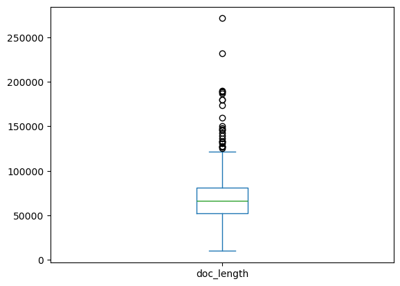
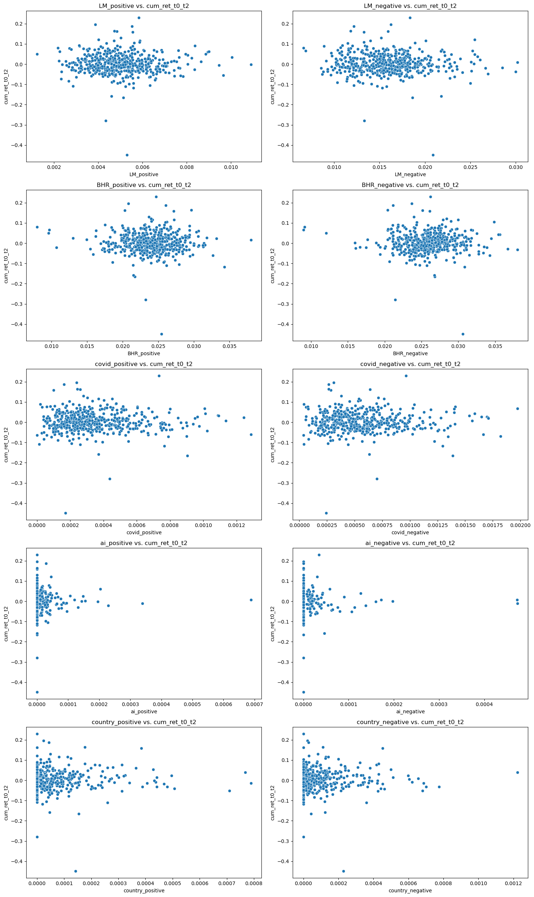
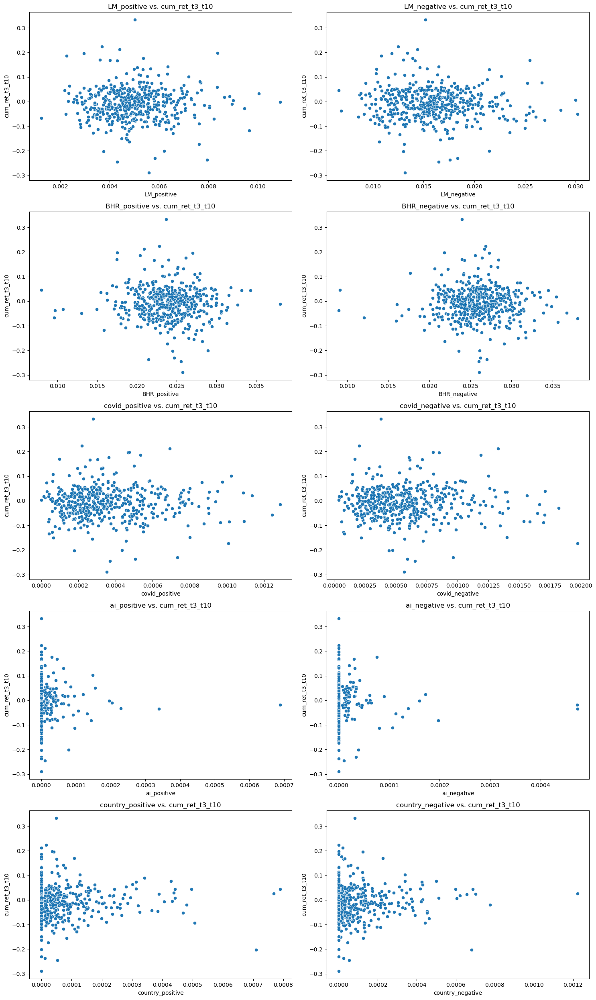

## I. Summary

The report investigates the relationship between sentiment scores derived from 10-K filings and subsequent stock returns for companies listed on the S&P 500 index as of 2022. The analysis focuses on sentiment variables from both the Loughran-McDonald (LM) dictionary and a machine learning (ML) sentiment list, encompassing categories such as positive and negative sentiment, along with sentiment related to COVID, artificial intelligence (AI), and sensitive countries.

The findings reveals a nuanced picture. While LM and ML sentiment variables exhibit negative associations with stock returns, the correlation coefficients are close to zero correlations, suggesting that there is no reliable relationship between sentiment scores and stock returns. Sentiments related to COVID, AI, and sensitive countries also showed no substantial correlation with stock returns.

## II. Data

```python
import pandas as pd
import matplotlib.pyplot as plt
import seaborn as sns
data = pd.read_csv('output/analysis_sample.csv') # load our data
sentiment_vars = ['LM_positive', 'LM_negative', 'BHR_positive', 'BHR_negative', 'covid_positive', 'covid_negative', 'ai_positive', 'ai_negative', 'country_positive', 'country_negative']
```

### Sample Description

The dataset, also known as sp500, comprises details concerning companies listed on the S&P 500 index as of 2022. It includes information about each company, sentiment scores derived from their 10-K filings, stock returns subsequent to the filing date, and their accounting data from 2021. The dataset consists of 498 observations and 92 variables, with the unique identifier being the ticker symbol associated with each firm.

The dataset is constructed from multiple data sources. 10-K filings and filing dates in 2022 are pulled from the SEC's EDGAR database. Sentiment scores are derived from the filings using the Loughran-McDonald dictionary and sentiment lists in the Journal of Financial Economics. Moreover, daily stock returns in 2022 and accounting data from the preceding year, 2021, are obtained from CRSP and Compustat, respectively. These datasets will be referred to as `crsp` and `ccm` throughout our report.

**Why does the dataset only have 498 observations?** The provided link to pull S&P500 firms from Wikipedia, as of 2022, actually contains 503 firms. Although called the S&P 500, the index contains 503 stocks because it includes two share classes of stock from 3 of its component companies. However, when we scraped 10-K filings, we only got data for 498 firms. This is because the 10-K filings are not available for First Republic Bank (FRC) and Signature Bank (SBNY). These two banks suffer from the 2023 banking crisis and no longer exists! Additionally, when getting the stock returns, we are unable to get the data for 3 firms: Berkshire Hathaway (BRK.B), Welltower (WELL), and Brown-Forman Corporation Class B (BF.B). Since 10-K filings and stock returns are the 2 key components to build the variables for this analysis, I decided to drop these companies with missing values. Hence, the dataset, initially comprising 503 firms, has been trimmed down to 498 firms.

Below is a snippet of the dataset:


```python
data.head()
```


<div>
<style scoped>
    .dataframe tbody tr th:only-of-type {
        vertical-align: middle;
    }

    .dataframe tbody tr th {
        vertical-align: top;
    }

    .dataframe thead th {
        text-align: right;
    }
</style>
<table border="1" class="dataframe">
  <thead>
    <tr style="text-align: right;">
      <th></th>
      <th>Symbol</th>
      <th>Security</th>
      <th>SEC filings</th>
      <th>GICS Sector</th>
      <th>GICS Sub-Industry</th>
      <th>Headquarters Location</th>
      <th>Date first added</th>
      <th>CIK</th>
      <th>Founded</th>
      <th>accession_number</th>
      <th>...</th>
      <th>mb</th>
      <th>prof_a</th>
      <th>ppe_a</th>
      <th>cash_a</th>
      <th>xrd_a</th>
      <th>dltt_a</th>
      <th>invopps_FG09</th>
      <th>sales_g</th>
      <th>dv_a</th>
      <th>short_debt</th>
    </tr>
  </thead>
  <tbody>
    <tr>
      <th>0</th>
      <td>MMM</td>
      <td>3M</td>
      <td>reports</td>
      <td>Industrials</td>
      <td>Industrial Conglomerates</td>
      <td>Saint Paul, Minnesota</td>
      <td>1976-08-09</td>
      <td>66740</td>
      <td>1902</td>
      <td>0000066740-22-000010</td>
      <td>...</td>
      <td>2.838265</td>
      <td>0.197931</td>
      <td>0.218538</td>
      <td>0.101228</td>
      <td>0.042361</td>
      <td>0.355625</td>
      <td>2.564301</td>
      <td>0.098527</td>
      <td>0.072655</td>
      <td>0.086095</td>
    </tr>
    <tr>
      <th>1</th>
      <td>AOS</td>
      <td>A. O. Smith</td>
      <td>reports</td>
      <td>Industrials</td>
      <td>Building Products</td>
      <td>Milwaukee, Wisconsin</td>
      <td>2017-07-26</td>
      <td>91142</td>
      <td>1916</td>
      <td>0000091142-22-000028</td>
      <td>...</td>
      <td>4.368153</td>
      <td>0.197847</td>
      <td>0.183974</td>
      <td>0.181729</td>
      <td>0.027113</td>
      <td>0.061075</td>
      <td>NaN</td>
      <td>0.222291</td>
      <td>0.048958</td>
      <td>0.080191</td>
    </tr>
    <tr>
      <th>2</th>
      <td>ABT</td>
      <td>Abbott</td>
      <td>reports</td>
      <td>Health Care</td>
      <td>Health Care Equipment</td>
      <td>North Chicago, Illinois</td>
      <td>1964-03-31</td>
      <td>1800</td>
      <td>1888</td>
      <td>0001104659-22-025141</td>
      <td>...</td>
      <td>3.825614</td>
      <td>0.166285</td>
      <td>0.134475</td>
      <td>0.136297</td>
      <td>0.036465</td>
      <td>0.242726</td>
      <td>3.559664</td>
      <td>0.244654</td>
      <td>0.042582</td>
      <td>0.051893</td>
    </tr>
    <tr>
      <th>3</th>
      <td>ABBV</td>
      <td>AbbVie</td>
      <td>reports</td>
      <td>Health Care</td>
      <td>Pharmaceuticals</td>
      <td>North Chicago, Illinois</td>
      <td>2012-12-31</td>
      <td>1551152</td>
      <td>2013 (1888)</td>
      <td>0001551152-22-000007</td>
      <td>...</td>
      <td>2.528878</td>
      <td>0.194433</td>
      <td>0.040074</td>
      <td>0.067086</td>
      <td>0.054911</td>
      <td>0.442929</td>
      <td>2.144449</td>
      <td>0.227438</td>
      <td>0.063203</td>
      <td>0.163364</td>
    </tr>
    <tr>
      <th>4</th>
      <td>ACN</td>
      <td>Accenture</td>
      <td>reports</td>
      <td>Information Technology</td>
      <td>IT Consulting &amp; Other Services</td>
      <td>Dublin, Ireland</td>
      <td>2011-07-06</td>
      <td>1467373</td>
      <td>1989</td>
      <td>0001467373-22-000295</td>
      <td>...</td>
      <td>5.474851</td>
      <td>0.195625</td>
      <td>0.111674</td>
      <td>0.189283</td>
      <td>0.025902</td>
      <td>0.063702</td>
      <td>5.023477</td>
      <td>0.140013</td>
      <td>0.051790</td>
      <td>0.215661</td>
    </tr>
  </tbody>
</table>
<p>5 rows × 92 columns</p>
</div>


### How the return variables are built and modified

Since the question is about the relationship between sentiment scores and stock returns, we need to get the stock returns around the filing dates. Therefore, we first need to pull the filing dates 

To obtain the 10-K filing dates, we did the following:
- Initiate an HTML session with custom headers to tell the SEC who we are before accessing the SEC's EDGAR database.
- Iterate through the `sp500` dataframe, retrieve the Central Index Key (CIK) and accession number for each company, and construct URLs for the corresponding index pages on the SEC's website.
- Use a GET request to obtain the HTML content of each page and attempt to locate the specific HTML element containing the filing date information.
- If successful, we extract the filing date and record it in the dataframe; otherwise, we mark it as missing.
- To prevent overwhelming the server, we introduce a small delay between requests.

Next, the process of constructing return variables is broken down into several steps aimed at aligning the filing dates of companies in the `sp500` dataset with their respective stock return data from the `crsp` dataset. 

1. **Cleaning missing values**: Missing stock return data is addressed by identifying and removing rows in the `sp500` dataset that correspond to ticker symbols not present in the `crsp` dataset. 

2. **Calculating Trading Days After Filing**: This involves locating the index of trading days in the `crsp` dataset that occur after the filing date for each company. Additionally, those rows with `trading_days_after_filing` out of the range of 0 to 10 are removed from the dataset.

```python
trading_days_after_filing = crsp[(crsp['ticker'] == ticker) & (crsp['date'] >= filing_date)].index
crsp.loc[trading_days_after_filing, 'trading_days_after_filing'] = range(0, len(trading_days_after_filing))
```
3. **Calculating Cumulative Returns:** The cumulative return for each company is calculated over two specific time spans: 
   - From the filing date to 2 days after the filing date (`cum_ret_t0_t2`)
   - From 3 days to 10 days after the filing date (`cum_ret_t3_t10`)
  
  The formula for calculating cumulative returns over a specific time span is as follows:

  $Cumulative Return = \prod_{i=1}^{n} (1 + r_i) - 1$
   
Below is a snippet of the return variables:


```python
data[['cum_ret_t0_t2', 'cum_ret_t3_t10']].head()
```


<div>
<style scoped>
    .dataframe tbody tr th:only-of-type {
        vertical-align: middle;
    }

    .dataframe tbody tr th {
        vertical-align: top;
    }

    .dataframe thead th {
        text-align: right;
    }
</style>
<table border="1" class="dataframe">
  <thead>
    <tr style="text-align: right;">
      <th></th>
      <th>cum_ret_t0_t2</th>
      <th>cum_ret_t3_t10</th>
    </tr>
  </thead>
  <tbody>
    <tr>
      <th>0</th>
      <td>0.008788</td>
      <td>0.004322</td>
    </tr>
    <tr>
      <th>1</th>
      <td>-0.050923</td>
      <td>-0.203420</td>
    </tr>
    <tr>
      <th>2</th>
      <td>-0.017255</td>
      <td>-0.051450</td>
    </tr>
    <tr>
      <th>3</th>
      <td>0.040400</td>
      <td>-0.004654</td>
    </tr>
    <tr>
      <th>4</th>
      <td>0.012347</td>
      <td>0.018329</td>
    </tr>
  </tbody>
</table>
</div>


### How the sentiment scores are built and modified

The sentiment variables are built and modified through the following steps:

**1. Prepare Regex Patterns**:

- Load the lists of negative and positive words from the provided ML sentiment lists. 
- Load the Loughran-McDonald (LM) Master Dictionary words from a CSV file and extract the positive and negative words by filtering words with values greater than 0 for the positive and negative columns respectively. According to [LM Dictionary Documentation](https://sraf.nd.edu/loughranmcdonald-master-dictionary/), "the sentiment words are flagged with a number indicating the year in which they were added to the list". Additionally, "a year preceded by a negative sign indicates the year/version when the word was removed from the sentiment category". Therefore, we will ignore words with either 0 or negative values in the positive and negative columns.
- Construct regex patterns for each sentiment category using the `NEAR_regex` function, which creates a regular expression pattern for matching words near each other. A snippet of the `NEAR_regex` function is shown below, in which `LM_positive` is a list of positive words from the LM dictionary.

```python
LM_positive_regex = NEAR_regex(['(' + '|'.join(LM_positive) + ')'])

```
**2. Prepare Regex Patterns for Topics**:
- Define lists of keywords related to three topics: COVID, Artifical Intelligence (AI), and sensitive countries (e.g., China, Ukraine, Russia, Taiwan, North Korea). All the keywords are in lowercase because we lowercase the text in the 10-K filings when processing them.
  - **COVID**: 'covid', 'coronavirus', 'pandemic', 'lockdown', 'quarantin', 'covid-19', 'covid19', 'social distancing', 'isolat'
  - **AI**: 'ai', 'artificial intelligence', 'machine learning', 'deep learning', 'neural network', 'nlp', 'natural language processing', 
      'computer vision', 'llm', 'large language model', 'gpt', 'artificial general intelligence', 'agi', 'cognitive computing', 
      'machine intelligence', 'genai', 'openai', 'chatgpt', 'chat-gpt', 'gpt-3', 'gpt-4'
  - **Countries**: 'china', 'chinese', 'taiwan', 'taiwanese', 'ukraine', 'ukrainian', 'russia', 'russian', 'south korea', 'korean', 'north korea'

- Combine these topic keywords with the positive and negative words from the ML sentiment list to create regex patterns. A snippet of the code is shown below for positive words related to COVID.

```python
covid_positive = ['(' + '|'.join(covid) + ')', '(' + '|'.join(BHR_positive) + ')']
covid_positive_regex = NEAR_regex(covid_positive, partial=True, max_words_between=10)
```
  


**3. Loop Over DataFrame to Extract Sentiment Scores**: Iterate over each row in the `sp500` dataframe. For each company, we:
- Retrieve the 10-K filings from a ZIP file, based on the Central Index Key (CIK).
- Extract the accession number from the filings and store it in the our `sp500` dataframe.
- Process the HTML content of the filings using *BeautifulSoup*. Lowercase the text and remove punctuation and excess whitespace.
- Calculate document length and the number of unique words in the document.
- Calculate the sentiment scores for each sentiment category and topic by counting the occurrences of words matching the regex patterns and dividing by the document length.
- Update the corresponding columns in the our dataframe with the calculated sentiment scores.

### Datapoints about the sentiment variables

- There are 347 words in the LM positive dictionary.
- There are 2345 words in the LM negative dictionary.
- There are 75 words in the ML positive dictionary.
- There are 94 words in the ML negative dictionary.

For the first 4 sentiment variables (`LM_positive`, `LM_negative`, `BHR_positive`, and `BHR_negative`), we leave `partial` and `max_words_between` as their default values in the `NEAR_regex` function. This decision is based on the assumption that the words in these lists are relatively short and unlikely to be part of longer words that could distort their meaning. Additionally, the default values are set to 5 and 20, respectively, which are reasonable for capturing sentiment words in a sentence.

For the last 6 sentiment variables (`covid_positive`, `covid_negative`, `ai_positive`, `ai_negative`, `country_positive`, and `country_negative`), we set the `max_words_between` parameter to 10 in the `NEAR_regex` function. This decision stems from a careful consideration of the typical length and complexity of sentences in 10-K reports. While the default `max_words_between` value in `NEAR_regex` is 5, reflecting an assumption of a 20-word sentence length, [research](https://www.researchgate.net/figure/Average-length-of-Form-10-K-reports-The-plot-shows-the-average-number-of-words-per-10-K_fig1_336767426#:~:text=Concurrently%2C%20over%20just%2010%20years,sentence%20to%2030.%20...&text=Context%202-,...,associated%20with%20less%20readable%20text) indicates that the average sentence length in a 10-K report is closer to 30 words. Therefore, adjusting the ratio to 5:20 suggests increasing `max_words_between` to approximately 7.5. However, to accommodate the dense technical language often encountered in 10-K reports, we rounded it up to 10. This adjustment allows for more inclusive matching while minimizing the risk of capturing irrelevant matches.

For COVID-related words, we set `partial` to `True` since we want to capture variations of the words in the list such as “isolated”, “isolation”, “isolating”, “quarantining”, “quarantine”. Additionally, there are not many longer words starting with `covid` such as `covidien`, so we shouldn't be concerned about capturing irrelevant matches.

For AI-reltaed word, due to the vast scope of the field, it's hard to compile an exhaustive list of all AI-related words. However, we will try our best by exhausting some of the most common words. Since “AI” is one of our search term and since “ai” is common in words like “Ukraine” we don’t want to accidentally get non-relevant terms. Therefore, we will set `partial` to `FALSE`

For country-related words, we set `partial` to `True` since we want to capture phrases like "US-China," "Russia-NATO tensions," and "Russia-Ukraine war." Additionally, longer versions of these terms are not common and unlikely to distort their original meaning. By allowing partial matches, we enhance our ability to capture relevant words.


### Reasons for the choice of the 3 topics (COVID, AI, and sensitive countries)

The choice of these topics is driven by their significant impact on financial markets and investor sentiment in recent years. 

1. **AI**: AI technologies have been increasingly integrated into various industries, impacting business operations, innovation, and market dynamics. Investors are keenly interested in companies' AI strategies, partnerships, and technological advancements, making it crucial to gauge sentiment surrounding AI-related discussions in corporate filings. Additionally, I chose AI because we are experiencing an AI boom now in 2023, exemplified by the surge in stock prices of AI companies like NVIDIA, Meta, AMD, and Microsoft. Therefore, it would be interesting to see how companies are discussing AI in their 10-K filings and how it affects their stock returns.

2. **COVID-19**: The COVID-19 pandemic has triggered unprecedented disruptions, including supply chain interruptions, changes in consumer behavior, and shifts in government regulations, all of which have significant implications for companies' operations, performance, and outlook. Moreover, the pandemic has accelerated digital transformation initiatives, prompting companies to adopt remote work arrangements, invest in digital technologies, and enhance their online presence to adapt to the new normal. Consequently, analyzing sentiment related to COVID in corporate filings provides valuable insights into how companies are navigating through these challenging times, addressing operational challenges, and capitalizing on emerging opportunities amidst the pandemic. Additionally, investors closely monitor COVID-related disclosures to assess companies' resilience, risk management strategies, and ability to withstand future crises, making it a crucial aspect of contextual sentiment analysis in financial markets.

3. **Sensitive Countries**: Geopolitical tensions and conflicts involving countries like China, Russia, Ukraine, and Taiwan can significantly affect financial markets and investor sentiment. One of the major events in 2022 is the Russia-Ukraine war, which has led to increased market volatility and uncertainty. Additionally, the tension between China and Taiwan, as well as the US-China trade relations, have gotten worse in recent years. Companies operating in these regions or having significant exposure to these countries may face unique challenges and risks. Therefore, analyzing sentiment around these sensitive countries in 10-K filings can help identify potential geopolitical risks and their impact on stock returns.

### Summmary statistics of our analysis sample


```python
data.info()
```

    <class 'pandas.core.frame.DataFrame'>
    RangeIndex: 498 entries, 0 to 497
    Data columns (total 92 columns):
     #   Column                 Non-Null Count  Dtype  
    ---  ------                 --------------  -----  
     0   Symbol                 498 non-null    object 
     1   Security               498 non-null    object 
     2   SEC filings            498 non-null    object 
     3   GICS Sector            498 non-null    object 
     4   GICS Sub-Industry      498 non-null    object 
     5   Headquarters Location  498 non-null    object 
     6   Date first added       453 non-null    object 
     7   CIK                    498 non-null    int64  
     8   Founded                498 non-null    object 
     9   accession_number       498 non-null    object 
     10  doc_length             498 non-null    float64
     11  unique_words           498 non-null    float64
     12  LM_positive            498 non-null    float64
     13  LM_negative            498 non-null    float64
     14  BHR_positive           498 non-null    float64
     15  BHR_negative           498 non-null    float64
     16  covid_positive         498 non-null    float64
     17  covid_negative         498 non-null    float64
     18  ai_positive            498 non-null    float64
     19  ai_negative            498 non-null    float64
     20  country_positive       498 non-null    float64
     21  country_negative       498 non-null    float64
     22  filing_date            498 non-null    object 
     23  ret_t0                 497 non-null    float64
     24  cum_ret_t0_t2          498 non-null    float64
     25  cum_ret_t3_t10         498 non-null    float64
     26  gvkey                  356 non-null    float64
     27  lpermno                356 non-null    float64
     28  lpermco                356 non-null    float64
     29  datadate               356 non-null    object 
     30  sic                    355 non-null    float64
     31  sic3                   355 non-null    float64
     32  td                     356 non-null    float64
     33  long_debt_dum          356 non-null    float64
     34  me                     356 non-null    float64
     35  l_a                    356 non-null    float64
     36  l_sale                 356 non-null    float64
     37  capx_a                 356 non-null    float64
     38  div_d                  356 non-null    float64
     39  age                    356 non-null    float64
     40  atr                    356 non-null    float64
     41  smalltaxlosscarry      270 non-null    float64
     42  largetaxlosscarry      270 non-null    float64
     43  gdpdef                 356 non-null    float64
     44  l_reala                356 non-null    float64
     45  l_reallongdebt         356 non-null    float64
     46  kz_index               331 non-null    float64
     47  ww_index               355 non-null    float64
     48  hp_index               356 non-null    float64
     49  ww_unconstrain         356 non-null    float64
     50  ww_constrained         355 non-null    float64
     51  kz_unconstrain         356 non-null    float64
     52  kz_constrained         331 non-null    float64
     53  hp_unconstrain         356 non-null    float64
     54  hp_constrained         356 non-null    float64
     55  tnic3tsimm             310 non-null    float64
     56  tnic3hhi               310 non-null    float64
     57  prodmktfluid           307 non-null    float64
     58  delaycon               0 non-null      float64
     59  equitydelaycon         0 non-null      float64
     60  debtdelaycon           0 non-null      float64
     61  privdelaycon           0 non-null      float64
     62  at_raw                 356 non-null    float64
     63  raw_Inv                356 non-null    float64
     64  raw_Ch_Cash            356 non-null    float64
     65  raw_Div                356 non-null    float64
     66  raw_Ch_Debt            356 non-null    float64
     67  raw_Ch_Eqty            356 non-null    float64
     68  raw_Ch_WC              356 non-null    float64
     69  raw_CF                 356 non-null    float64
     70  l_emp                  356 non-null    float64
     71  l_ppent                356 non-null    float64
     72  l_laborratio           356 non-null    float64
     73  Inv                    356 non-null    float64
     74  Ch_Cash                356 non-null    float64
     75  Div                    356 non-null    float64
     76  Ch_Debt                356 non-null    float64
     77  Ch_Eqty                356 non-null    float64
     78  Ch_WC                  356 non-null    float64
     79  CF                     356 non-null    float64
     80  td_a                   356 non-null    float64
     81  td_mv                  356 non-null    float64
     82  mb                     356 non-null    float64
     83  prof_a                 356 non-null    float64
     84  ppe_a                  356 non-null    float64
     85  cash_a                 356 non-null    float64
     86  xrd_a                  356 non-null    float64
     87  dltt_a                 356 non-null    float64
     88  invopps_FG09           333 non-null    float64
     89  sales_g                355 non-null    float64
     90  dv_a                   356 non-null    float64
     91  short_debt             356 non-null    float64
    dtypes: float64(80), int64(1), object(11)
    memory usage: 358.1+ KB


Below is all the variables in our dataset and their summary statistics:


```python
data.columns
```


    Index(['Symbol', 'Security', 'SEC filings', 'GICS Sector', 'GICS Sub-Industry',
           'Headquarters Location', 'Date first added', 'CIK', 'Founded',
           'accession_number', 'doc_length', 'unique_words', 'LM_positive',
           'LM_negative', 'BHR_positive', 'BHR_negative', 'covid_positive',
           'covid_negative', 'ai_positive', 'ai_negative', 'country_positive',
           'country_negative', 'filing_date', 'ret_t0', 'cum_ret_t0_t2',
           'cum_ret_t3_t10', 'gvkey', 'lpermno', 'lpermco', 'datadate', 'sic',
           'sic3', 'td', 'long_debt_dum', 'me', 'l_a', 'l_sale', 'capx_a', 'div_d',
           'age', 'atr', 'smalltaxlosscarry', 'largetaxlosscarry', 'gdpdef',
           'l_reala', 'l_reallongdebt', 'kz_index', 'ww_index', 'hp_index',
           'ww_unconstrain', 'ww_constrained', 'kz_unconstrain', 'kz_constrained',
           'hp_unconstrain', 'hp_constrained', 'tnic3tsimm', 'tnic3hhi',
           'prodmktfluid', 'delaycon', 'equitydelaycon', 'debtdelaycon',
           'privdelaycon', 'at_raw', 'raw_Inv', 'raw_Ch_Cash', 'raw_Div',
           'raw_Ch_Debt', 'raw_Ch_Eqty', 'raw_Ch_WC', 'raw_CF', 'l_emp', 'l_ppent',
           'l_laborratio', 'Inv', 'Ch_Cash', 'Div', 'Ch_Debt', 'Ch_Eqty', 'Ch_WC',
           'CF', 'td_a', 'td_mv', 'mb', 'prof_a', 'ppe_a', 'cash_a', 'xrd_a',
           'dltt_a', 'invopps_FG09', 'sales_g', 'dv_a', 'short_debt'],
          dtype='object')


```python
data.describe()
```


<div>
<style scoped>
    .dataframe tbody tr th:only-of-type {
        vertical-align: middle;
    }

    .dataframe tbody tr th {
        vertical-align: top;
    }

    .dataframe thead th {
        text-align: right;
    }
</style>
<table border="1" class="dataframe">
  <thead>
    <tr style="text-align: right;">
      <th></th>
      <th>CIK</th>
      <th>doc_length</th>
      <th>unique_words</th>
      <th>LM_positive</th>
      <th>LM_negative</th>
      <th>BHR_positive</th>
      <th>BHR_negative</th>
      <th>covid_positive</th>
      <th>covid_negative</th>
      <th>ai_positive</th>
      <th>...</th>
      <th>mb</th>
      <th>prof_a</th>
      <th>ppe_a</th>
      <th>cash_a</th>
      <th>xrd_a</th>
      <th>dltt_a</th>
      <th>invopps_FG09</th>
      <th>sales_g</th>
      <th>dv_a</th>
      <th>short_debt</th>
    </tr>
  </thead>
  <tbody>
    <tr>
      <th>count</th>
      <td>4.980000e+02</td>
      <td>498.000000</td>
      <td>498.000000</td>
      <td>498.000000</td>
      <td>498.000000</td>
      <td>498.000000</td>
      <td>498.000000</td>
      <td>498.000000</td>
      <td>498.000000</td>
      <td>498.000000</td>
      <td>...</td>
      <td>356.000000</td>
      <td>356.000000</td>
      <td>356.000000</td>
      <td>356.000000</td>
      <td>356.000000</td>
      <td>356.000000</td>
      <td>333.000000</td>
      <td>355.000000</td>
      <td>356.000000</td>
      <td>356.000000</td>
    </tr>
    <tr>
      <th>mean</th>
      <td>7.913731e+05</td>
      <td>70659.650602</td>
      <td>5473.020080</td>
      <td>0.004985</td>
      <td>0.015902</td>
      <td>0.023951</td>
      <td>0.025901</td>
      <td>0.000354</td>
      <td>0.000574</td>
      <td>0.000011</td>
      <td>...</td>
      <td>3.540167</td>
      <td>0.156849</td>
      <td>0.243211</td>
      <td>0.131143</td>
      <td>0.028001</td>
      <td>0.318896</td>
      <td>3.205683</td>
      <td>0.275757</td>
      <td>0.024060</td>
      <td>0.093124</td>
    </tr>
    <tr>
      <th>std</th>
      <td>5.531218e+05</td>
      <td>29313.030499</td>
      <td>1094.758437</td>
      <td>0.001315</td>
      <td>0.003691</td>
      <td>0.003486</td>
      <td>0.003384</td>
      <td>0.000219</td>
      <td>0.000327</td>
      <td>0.000043</td>
      <td>...</td>
      <td>2.856880</td>
      <td>0.085701</td>
      <td>0.210942</td>
      <td>0.120292</td>
      <td>0.043937</td>
      <td>0.184582</td>
      <td>2.901969</td>
      <td>0.799011</td>
      <td>0.027553</td>
      <td>0.090781</td>
    </tr>
    <tr>
      <th>min</th>
      <td>1.800000e+03</td>
      <td>9785.000000</td>
      <td>1521.000000</td>
      <td>0.001226</td>
      <td>0.006609</td>
      <td>0.007966</td>
      <td>0.008953</td>
      <td>0.000000</td>
      <td>0.000037</td>
      <td>0.000000</td>
      <td>...</td>
      <td>0.878375</td>
      <td>-0.099432</td>
      <td>0.013654</td>
      <td>0.003713</td>
      <td>0.000000</td>
      <td>0.002061</td>
      <td>0.481436</td>
      <td>-0.658981</td>
      <td>0.000000</td>
      <td>0.000000</td>
    </tr>
    <tr>
      <th>25%</th>
      <td>9.754325e+04</td>
      <td>52073.500000</td>
      <td>4805.000000</td>
      <td>0.004095</td>
      <td>0.013296</td>
      <td>0.021975</td>
      <td>0.023965</td>
      <td>0.000203</td>
      <td>0.000331</td>
      <td>0.000000</td>
      <td>...</td>
      <td>1.653910</td>
      <td>0.099672</td>
      <td>0.092214</td>
      <td>0.043401</td>
      <td>0.000000</td>
      <td>0.197402</td>
      <td>1.348265</td>
      <td>0.083582</td>
      <td>0.000000</td>
      <td>0.026782</td>
    </tr>
    <tr>
      <th>50%</th>
      <td>8.840640e+05</td>
      <td>65834.000000</td>
      <td>5346.500000</td>
      <td>0.004899</td>
      <td>0.015644</td>
      <td>0.024104</td>
      <td>0.025897</td>
      <td>0.000302</td>
      <td>0.000519</td>
      <td>0.000000</td>
      <td>...</td>
      <td>2.555072</td>
      <td>0.142768</td>
      <td>0.162383</td>
      <td>0.097425</td>
      <td>0.008254</td>
      <td>0.301588</td>
      <td>2.188377</td>
      <td>0.157699</td>
      <td>0.017442</td>
      <td>0.064252</td>
    </tr>
    <tr>
      <th>75%</th>
      <td>1.137785e+06</td>
      <td>80897.250000</td>
      <td>5910.750000</td>
      <td>0.005655</td>
      <td>0.017827</td>
      <td>0.026111</td>
      <td>0.027807</td>
      <td>0.000470</td>
      <td>0.000726</td>
      <td>0.000000</td>
      <td>...</td>
      <td>4.314180</td>
      <td>0.201403</td>
      <td>0.341133</td>
      <td>0.171776</td>
      <td>0.039759</td>
      <td>0.407029</td>
      <td>3.877741</td>
      <td>0.282148</td>
      <td>0.037061</td>
      <td>0.125030</td>
    </tr>
    <tr>
      <th>max</th>
      <td>1.868275e+06</td>
      <td>271718.000000</td>
      <td>10238.000000</td>
      <td>0.010899</td>
      <td>0.030185</td>
      <td>0.037982</td>
      <td>0.038030</td>
      <td>0.001286</td>
      <td>0.001972</td>
      <td>0.000688</td>
      <td>...</td>
      <td>14.733148</td>
      <td>0.405925</td>
      <td>0.888302</td>
      <td>0.607837</td>
      <td>0.295576</td>
      <td>1.019505</td>
      <td>14.066011</td>
      <td>14.183099</td>
      <td>0.164573</td>
      <td>0.530059</td>
    </tr>
  </tbody>
</table>
<p>8 rows × 81 columns</p>
</div>


Our data contains mostly numerical variables from the accounting data, sentiment scores, and stock returns. It also contains some string variables such as the company name, ticker, and industry. 


```python
data.dtypes.value_counts()
```


    float64    80
    object     11
    int64       1
    Name: count, dtype: int64


There are still some missing values in our data, particularly in the date the firm is added to the S&P500 and its 2021 accounting data from `ccm`. However, these are not the key variables for our analysis, so it's unnecessary to remove it from our dataset. The key variables, sentiment scores and stock returns, are complete for all firms in our sample. Below are the variables with missing values:


```python
data.columns[data.isnull().any()]
```


    Index(['Date first added', 'ret_t0', 'gvkey', 'lpermno', 'lpermco', 'datadate',
           'sic', 'sic3', 'td', 'long_debt_dum', 'me', 'l_a', 'l_sale', 'capx_a',
           'div_d', 'age', 'atr', 'smalltaxlosscarry', 'largetaxlosscarry',
           'gdpdef', 'l_reala', 'l_reallongdebt', 'kz_index', 'ww_index',
           'hp_index', 'ww_unconstrain', 'ww_constrained', 'kz_unconstrain',
           'kz_constrained', 'hp_unconstrain', 'hp_constrained', 'tnic3tsimm',
           'tnic3hhi', 'prodmktfluid', 'delaycon', 'equitydelaycon',
           'debtdelaycon', 'privdelaycon', 'at_raw', 'raw_Inv', 'raw_Ch_Cash',
           'raw_Div', 'raw_Ch_Debt', 'raw_Ch_Eqty', 'raw_Ch_WC', 'raw_CF', 'l_emp',
           'l_ppent', 'l_laborratio', 'Inv', 'Ch_Cash', 'Div', 'Ch_Debt',
           'Ch_Eqty', 'Ch_WC', 'CF', 'td_a', 'td_mv', 'mb', 'prof_a', 'ppe_a',
           'cash_a', 'xrd_a', 'dltt_a', 'invopps_FG09', 'sales_g', 'dv_a',
           'short_debt'],
          dtype='object')


The average length of a 10-K filing in our dataset is 70,659 words with a standard deviation of 29,313 words.


```python
data.doc_length.describe()
```


    count       498.000000
    mean      70659.650602
    std       29313.030499
    min        9785.000000
    25%       52073.500000
    50%       65834.000000
    75%       80897.250000
    max      271718.000000
    Name: doc_length, dtype: float64


It seems like we have 2 outliers with a document length over 200,000 words. 


```python
data.doc_length.plot(kind='box')
```


    <Axes: >


    

    


Despite having a mean of 70,659 words, we only have 5,473 unique words in our dataset. This suggests that there are many repeated words in the 10-K filings.


```python
data.unique_words.describe()
```


    count      498.000000
    mean      5473.020080
    std       1094.758437
    min       1521.000000
    25%       4805.000000
    50%       5346.500000
    75%       5910.750000
    max      10238.000000
    Name: unique_words, dtype: float64


The Information Technology sector has the highest number of firms in our dataset, followed by the Industrials sector. The Energy sector has the fewest number of firms.


```python
data["GICS Sector"].value_counts()
```


    GICS Sector
    Information Technology    76
    Industrials               70
    Financials                64
    Health Care               63
    Consumer Discretionary    56
    Consumer Staples          32
    Utilities                 30
    Real Estate               30
    Materials                 29
    Communication Services    25
    Energy                    23
    Name: count, dtype: int64


### Smell test on our contextual sentiment measures

Our sentiment variables have variations in their values, especially the sentiment scores derived from the 2 dictionaries and COVID-related sentiment scores with 495 unique values.


```python
data[sentiment_vars].nunique()
```


    LM_positive         495
    LM_negative         495
    BHR_positive        495
    BHR_negative        495
    covid_positive      495
    covid_negative      495
    ai_positive         104
    ai_negative          81
    country_positive    291
    country_negative    312
    dtype: int64


Since the number of unique values for negative words associated with AI is so low (81), I want to see what the most common value is. Surprisingly, it has a common value of 0. Does this mean AI is rarely discussed negatively in 10-K filings?


```python
data['ai_negative'].value_counts()
```


    ai_negative
    0.000000    417
    0.000040      2
    0.000014      1
    0.000473      1
    0.000034      1
               ... 
    0.000021      1
    0.000021      1
    0.000021      1
    0.000019      1
    0.000046      1
    Name: count, Length: 81, dtype: int64


Not surprisingly, the tech industry has the highest average sentiment scores for positive words associated with AI.


```python
data.groupby('GICS Sector')['ai_positive'].mean().sort_values(ascending=False)
```


    GICS Sector
    Information Technology    4.705074e-05
    Energy                    1.463102e-05
    Communication Services    8.739814e-06
    Consumer Discretionary    5.939772e-06
    Health Care               5.490543e-06
    Industrials               3.035709e-06
    Financials                2.928917e-06
    Materials                 1.668180e-06
    Real Estate               9.154574e-07
    Consumer Staples          8.406718e-07
    Utilities                 3.072197e-07
    Name: ai_positive, dtype: float64


For the sentiment scores derived from the 2 dictionaries, the average negative sentiment score is higher than the average positive sentiment score. COVID and sensitive countries are also discussed more negatively than positively while AI is the opposite.


```python
data[sentiment_vars].describe()
```


<div>
<style scoped>
    .dataframe tbody tr th:only-of-type {
        vertical-align: middle;
    }

    .dataframe tbody tr th {
        vertical-align: top;
    }

    .dataframe thead th {
        text-align: right;
    }
</style>
<table border="1" class="dataframe">
  <thead>
    <tr style="text-align: right;">
      <th></th>
      <th>LM_positive</th>
      <th>LM_negative</th>
      <th>BHR_positive</th>
      <th>BHR_negative</th>
      <th>covid_positive</th>
      <th>covid_negative</th>
      <th>ai_positive</th>
      <th>ai_negative</th>
      <th>country_positive</th>
      <th>country_negative</th>
    </tr>
  </thead>
  <tbody>
    <tr>
      <th>count</th>
      <td>498.000000</td>
      <td>498.000000</td>
      <td>498.000000</td>
      <td>498.000000</td>
      <td>498.000000</td>
      <td>498.000000</td>
      <td>498.000000</td>
      <td>498.000000</td>
      <td>498.000000</td>
      <td>498.000000</td>
    </tr>
    <tr>
      <th>mean</th>
      <td>0.004985</td>
      <td>0.015902</td>
      <td>0.023951</td>
      <td>0.025901</td>
      <td>0.000354</td>
      <td>0.000574</td>
      <td>0.000011</td>
      <td>0.000008</td>
      <td>0.000063</td>
      <td>0.000084</td>
    </tr>
    <tr>
      <th>std</th>
      <td>0.001315</td>
      <td>0.003691</td>
      <td>0.003486</td>
      <td>0.003384</td>
      <td>0.000219</td>
      <td>0.000327</td>
      <td>0.000043</td>
      <td>0.000036</td>
      <td>0.000108</td>
      <td>0.000138</td>
    </tr>
    <tr>
      <th>min</th>
      <td>0.001226</td>
      <td>0.006609</td>
      <td>0.007966</td>
      <td>0.008953</td>
      <td>0.000000</td>
      <td>0.000037</td>
      <td>0.000000</td>
      <td>0.000000</td>
      <td>0.000000</td>
      <td>0.000000</td>
    </tr>
    <tr>
      <th>25%</th>
      <td>0.004095</td>
      <td>0.013296</td>
      <td>0.021975</td>
      <td>0.023965</td>
      <td>0.000203</td>
      <td>0.000331</td>
      <td>0.000000</td>
      <td>0.000000</td>
      <td>0.000000</td>
      <td>0.000000</td>
    </tr>
    <tr>
      <th>50%</th>
      <td>0.004899</td>
      <td>0.015644</td>
      <td>0.024104</td>
      <td>0.025897</td>
      <td>0.000302</td>
      <td>0.000519</td>
      <td>0.000000</td>
      <td>0.000000</td>
      <td>0.000021</td>
      <td>0.000029</td>
    </tr>
    <tr>
      <th>75%</th>
      <td>0.005655</td>
      <td>0.017827</td>
      <td>0.026111</td>
      <td>0.027807</td>
      <td>0.000470</td>
      <td>0.000726</td>
      <td>0.000000</td>
      <td>0.000000</td>
      <td>0.000079</td>
      <td>0.000113</td>
    </tr>
    <tr>
      <th>max</th>
      <td>0.010899</td>
      <td>0.030185</td>
      <td>0.037982</td>
      <td>0.038030</td>
      <td>0.001286</td>
      <td>0.001972</td>
      <td>0.000688</td>
      <td>0.000473</td>
      <td>0.000789</td>
      <td>0.001223</td>
    </tr>
  </tbody>
</table>
</div>


## III. Results

### Correlation between sentiment scores and stock returns


```python
cor_matrix = data[['cum_ret_t0_t2', 'cum_ret_t3_t10'] + sentiment_vars].corr().iloc[2:, :2]
cor_matrix
```


<div>
<style scoped>
    .dataframe tbody tr th:only-of-type {
        vertical-align: middle;
    }

    .dataframe tbody tr th {
        vertical-align: top;
    }

    .dataframe thead th {
        text-align: right;
    }
</style>
<table border="1" class="dataframe">
  <thead>
    <tr style="text-align: right;">
      <th></th>
      <th>cum_ret_t0_t2</th>
      <th>cum_ret_t3_t10</th>
    </tr>
  </thead>
  <tbody>
    <tr>
      <th>LM_positive</th>
      <td>-0.018815</td>
      <td>-0.002624</td>
    </tr>
    <tr>
      <th>LM_negative</th>
      <td>-0.054411</td>
      <td>-0.050043</td>
    </tr>
    <tr>
      <th>BHR_positive</th>
      <td>-0.040262</td>
      <td>-0.033669</td>
    </tr>
    <tr>
      <th>BHR_negative</th>
      <td>-0.046220</td>
      <td>-0.026273</td>
    </tr>
    <tr>
      <th>covid_positive</th>
      <td>-0.027633</td>
      <td>-0.014534</td>
    </tr>
    <tr>
      <th>covid_negative</th>
      <td>-0.022327</td>
      <td>-0.022329</td>
    </tr>
    <tr>
      <th>ai_positive</th>
      <td>0.000262</td>
      <td>0.008965</td>
    </tr>
    <tr>
      <th>ai_negative</th>
      <td>-0.026054</td>
      <td>-0.021829</td>
    </tr>
    <tr>
      <th>country_positive</th>
      <td>0.012590</td>
      <td>0.012475</td>
    </tr>
    <tr>
      <th>country_negative</th>
      <td>0.011745</td>
      <td>0.032722</td>
    </tr>
  </tbody>
</table>
</div>


### Scatter plots of sentiment scores and stock returns


```python
fig, axs = plt.subplots(5, 2, figsize=(15, 25))
for i, var in enumerate(sentiment_vars):
    sns.scatterplot(data=data, x=var, y='cum_ret_t0_t2', ax=axs[i//2, i%2])
    axs[i//2, i%2].set_title(f'{var} vs. cum_ret_t0_t2')
    axs[i//2, i%2].set_xlabel(var)
    axs[i//2, i%2].set_ylabel('cum_ret_t0_t2')
plt.tight_layout()
plt.show()
```


    

    


```python
plt.figure(figsize=(15, 25))
for i, var in enumerate(sentiment_vars):
    plt.subplot(5, 2, i+1)
    sns.scatterplot(data=data, x=var, y='cum_ret_t3_t10')
    plt.title(f'{var} vs. cum_ret_t3_t10')
    plt.xlabel(var)
    plt.ylabel('cum_ret_t3_t10')
plt.tight_layout()
```


    

    


### Discussion 1: 

Both LM and ML sentiment variables show negative relationships with cumulative return between the filing date and 2 days after it . However, LM Negative sentiment exhibits the most negative relationship, followed by ML Negative, ML Positive, and LM Positive, in decreasing order of magnitude.

However, it's hard to derive a clear conclusion from the relationship between sentiment scores and stock returns since the correlation coefficients are close to 0 and the scatter plots show no clear patterns (more like a horizontal line). Additionally, we expect that there will be a positive relationship between positive sentiment scores and stock returns, but the results show a negative relationship. This could be due to the limitations of the sentiment analysis method or the complexity of the relationship between sentiment scores and stock returns. 

### Discussion 2:

The results from our analysis conflict with Table 3 of the Garcia, Hu, and Rohrer paper. The correlation coefficients between the returns variable and the sentiment scores are close to 0 in our analysis, indicating no clear relationship between the two variables. In contrast, Table 3 of the Garcia, Hu, and Rohrer paper shows correlations between the returns variable and the sentiment scores with coefficients closer to 1 and -1. In addition, the table shows that there is a negative relationship between the returns variable and the negative sentiment scores, and a positive relationship between the returns variable and the positive sentiment scores. However, our results contradict this finding. These discrepancies could be due to differences in the sentiment analysis methods, sample selection, or data processing techniques used in the two studies. 

### Discussion 3:

The 3 “contextual” sentiment measures (COVID, AI, and sensitive countries) have correlation coefficients with the returns variable that are close to 0, indicating no clear relationship between the sentiment scores and stock returns. 

### Discussion 4:

There is some differences in the sign of the relationship between the 3 contextual sentiment scores and stock returns. For example, the COVID sentiment scores have a negative relationship with stock returns while the sensitive countries sentiment scores have a positive relationship with stock returns. AI positive sentiment scores have a positive relationship with stock returns while AI negative sentiment scores have a negative relationship with stock returns. However, the magnitude of the correlation coefficients is close to 0 for all 3 contextual sentiment scores. Therefore, there is no meaningful relationship between the 3 contextual sentiment scores and stock returns despite the differences in sign. This could be due to the limitations of the sentiment analysis method or the complexity of the relationship between the 3 contextual sentiment scores and stock returns.


